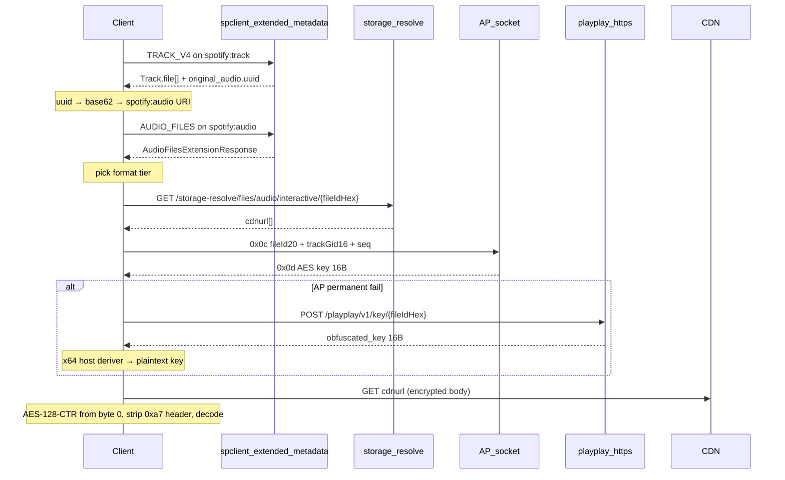

# Spotify Audio File-ID Pipeline — Agent Reference

*Canonical guide for discovering playable audio `file_id`s, resolving CDN URLs, fetching AES keys, and decrypting streams. Grounded in a 2026-07-04 desktop HAR capture (track **Sadas** / Amirabbas Golab) and mapped to Wavee protos/code.*

**Related:** [wavee-playplay-audio-key-plan.md](wavee-playplay-audio-key-plan.md) (key fetch + decrypt implementation plan).

**HAR artifacts:** `c:\Users\ChristosKarapasias\Documents\exx_extracted\` (decoded request/response bins + `.txt`).

---

## 1. Glossary

| Term | Meaning |
|---|---|
| **gid** | 16-byte entity UUID (big-endian) for track/album/artist |
| **base62 id** | 22-char Spotify ID (`3pOMw08ZBod5r2KGZCIro6`). Encode/decode: `Wavee/Backend/Spotify/Base62.cs` |
| **file_id** | 20-byte opaque CDN object identifier. Hex string used in `storage-resolve` and `playplay` URLs |
| **spotify:audio:** URI | Separate audio entity; **not** the same as `spotify:track:`. Derived from `Track.original_audio.uuid` |
| **interactive** | Streaming mode (vs download) — must match across `storage-resolve` and PlayPlay |

---

## 2. End-to-end pipeline



---

## 3. Phase A — Discover file IDs (extended-metadata only)

> **Deprecated routes**
>
> `GET /metadata/4/track/{gid-hex}` may still return a `spotify.metadata.Track` **shell** (name, album, artists, duration) but **`file[]` is empty or omitted server-side**. It does **not** carry playable file IDs anymore (verified against 2026 desktop behavior). **Do not use this route for playback resolution.**

File IDs are discoverable **only** via extended-metadata.

### Endpoint

```
POST https://{region}-spclient.spotify.com/extended-metadata/v0/extended-metadata
```

### Wire format

| Direction | Encoding | Body |
|---|---|---|
| Request | **gzip** | `BatchedEntityRequest` |
| Response | often **zstd** (`28 B5 2F FD` magic), sometimes raw | `BatchedExtensionResponse` |

Headers (required): `Authorization: Bearer …`, `client-token`, `Content-Type: application/protobuf`, `Accept: application/protobuf`. Optional: `client-feature-id` (identifies caller subsystem in HAR).

Proto definitions: `Wavee/SpotifyLive/Protos/extended_metadata.proto`, `entity_extension_data.proto`, `extension_kind.proto`.

### Proto envelope

```
BatchedEntityRequest
  header: BatchedEntityRequestHeader { country, catalogue, task_id[16] }
  entity_request[]: EntityRequest {
    entity_uri: string
    query[]: ExtensionQuery { extension_kind, etag? }
  }

BatchedExtensionResponse
  extended_metadata[]: EntityExtensionDataArray {
    extension_kind: ExtensionKind
    header?: { provider_error_status, cache_ttl_in_seconds, offline_ttl_in_seconds }
    extension_data[]: EntityExtensionData {
      header?: { status_code, etag, cache_ttl_in_seconds, offline_ttl_in_seconds }
      entity_uri: string
      extension_data: google.protobuf.Any   // inner payload bytes
    }
  }
```

Per-entity `status_code`: `200` = payload present, `404` = extension not available for this entity, `304` = not modified (when `etag` sent in query).

### Discovery paths (observed in exx.har)

| client-feature-id | ExtensionKind | Entity URI | Inner `Any` type_url | Carries file_id? |
|---|---|---|---|---|
| `track_metadata_loader` | 10 `TRACK_V4` | `spotify:track:…` | `type.googleapis.com/spotify.metadata.Track` | Yes — `file[]` field 12 |
| `audio_track_player` | 5 `AUDIO_FILES` | `spotify:audio:…` | `type.googleapis.com/spotify.extendedmetadata.audiofiles.AudioFilesExtensionResponse` | Yes — full ladder incl. FLAC |
| `prefetch` | 212 `PLAYBACK_TRAIT` + 5 `AUDIO_FILES` | track + audio | `…PlaybackTrait` + AudioFiles | Yes — player-ready bundle |
| `player_mdata` | 98, 99 | `spotify:track:…` | associations | No — video/audio URI mapping only |
| `context_mdata` | 16, 98, 99, 239 | `spotify:track:…` | canvas, assocs, capability | No file IDs |

### Deriving `spotify:audio:` URI

From the `TRACK_V4` payload:

```
Track.original_audio.uuid   (16 bytes, protobuf field 24)
  → Base62.Encode(uuid, width=22)
  → "spotify:audio:{base62}"
```

**Worked example (exx.har):**

| Field | Value |
|---|---|
| Track URI | `spotify:track:3pOMw08ZBod5r2KGZCIro6` |
| Track gid (hex) | `7040dc9abf224ff89dd8ac461d9fb822` |
| `original_audio.uuid` (hex) | `b1a468375e074400b05c419f71e4f489` |
| Audio URI | `spotify:audio:5pcM7rgy3bRuxEkhFqsFBf` |

Then fetch `AUDIO_FILES` (kind 5) on the **audio** URI — not the track URI — for the complete format ladder (including FLAC).

### Alternative tracks

Inside the `TRACK_V4` `spotify.metadata.Track` payload, `alternative[]` (field 13) may hold the **only** playable `file[]` when the main track's `file[]` is empty (market/licensing). When using the AP key path, use the **alternative track's gid** as `track_gid`, not the parent's.

---

## 4. Phase B — Format enum map

Source: `Wavee/SpotifyLive/Protos/metadata.proto` — `AudioFile.Format`.

| Enum | Name | Role | Container after decrypt |
|---|---|---|---|
| 0 | `OGG_VORBIS_96` | Lowest Ogg tier | Ogg Vorbis (`OggS` at offset 0xa7) |
| 1 | `OGG_VORBIS_160` | Standard Ogg | Ogg Vorbis |
| 2 | `OGG_VORBIS_320` | Premium default Ogg | Ogg Vorbis |
| 3 | `MP3_256` | Legacy | MP3 |
| 4 | `MP3_320` | Legacy | MP3 |
| 5 | `MP3_160` | Legacy | MP3 |
| 6 | `MP3_96` | Preview clips (`Track.preview[]`, field 15) | MP3 |
| 7 | `MP3_160_ENC` | Encrypted MP3 | — |
| 8 | `AAC_24` | Low-bandwidth | AAC |
| 9 | `AAC_48` | Mobile | AAC |
| 16 | `FLAC_FLAC` | HiFi | FLAC |
| 18 | `XHE_AAC_24` | Podcast / low bitrate | xHE-AAC |
| 19 | `XHE_AAC_16` | Podcast | xHE-AAC |
| 20 | `XHE_AAC_12` | Podcast | xHE-AAC |
| 22 | `FLAC_FLAC_24BIT` | HiFi 24-bit | FLAC |

### Inner message shape

```protobuf
message AudioFile {
  optional bytes file_id = 1;   // exactly 20 bytes
  optional Format format = 2;
}
```

`file_id` is **always 20 bytes** on the wire. Hex-encode lowercase for URL paths.

### Where each format appears (exx.har pattern)

| Source | Ogg 96/160/320 | AAC | FLAC | MP3 preview |
|---|---|---|---|---|
| `TRACK_V4` → `Track.file[]` | Yes | Yes (AAC_24) | **No** | No (preview is separate field) |
| `AUDIO_FILES` on `spotify:audio:` | Yes | Yes | **Yes** | No |
| `Track.preview[]` | No | No | No | Yes (MP3_96) |
| `PreviewPlaybackTrait` (kind 181) | No | No | No | CDN preview URL (not a file_id path) |

**Rule:** For HiFi/FLAC playback, you **must** hit `AUDIO_FILES` on the `spotify:audio:` entity. `TRACK_V4` alone is insufficient for FLAC on this capture.

---

## 5. Worked example — full file ladder

Track: **Sadas** — `spotify:track:3pOMw08ZBod5r2KGZCIro6`

### From `TRACK_V4` (`Track.file[]`, field 12)

| file_id (hex) | Format | Enum |
|---|---|---|
| `9ffe2d20d9a733e3c2e0f9c3c07c29dcd36f6c59` | OGG_VORBIS_320 | 2 |
| `f8a321035aa91f016c33c6b1c63bfabf89e18c2b` | OGG_VORBIS_160 | 1 |
| `70e5956b913a3ec2385ee78e9e785446568e24bd` | OGG_VORBIS_96 | 0 |
| `b23ad9549e4aaeeb5d0756c0c00a720879546eb5` | AAC_24 | 8 |

### From `AUDIO_FILES` on `spotify:audio:5pcM7rgy3bRuxEkhFqsFBf`

Includes all rows above **plus**:

| file_id (hex) | Format | Enum |
|---|---|---|
| `93d4611b358cde6d51e2ba7d1e347658857dd38e` | FLAC_FLAC | 16 |

### Preview (not full playback)

| file_id (hex) | Format | Source |
|---|---|---|
| `a17ee9a684fd17f14bed327d153b2a8eaa851fd8` | MP3_96 (6) | `Track.preview[]` field 15 |

Preview URL also surfaced in `PreviewPlaybackTrait` (kind 181) as an HTTPS mp3-preview link — no `storage-resolve` needed for 30s clips.

### Quality selection

| Client | Behavior |
|---|---|
| Spotify desktop (2026) | User setting: Auto / Ogg tiers / FLAC / etc. |
| Wavee `LiveTrackResolver.PickFrom` | Ogg 320 → 160 → 96 only; **ignores FLAC** |

Premium with all Ogg tiers available typically selects **OGG 320** (`9ffe2d20…`), not 160 (`f8a32103…`), unless restricted or user-configured.

---

## 6. Phase C — CDN resolve (storage-resolve)

```
GET /storage-resolve/files/audio/interactive/{fileIdHex}
→ application/protobuf StorageResolveResponse
```

Proto: `Wavee/SpotifyLive/Protos/storage-resolve.proto`

```protobuf
message StorageResolveResponse {
  enum Result { CDN = 0; STORAGE = 1; RESTRICTED = 3; }
  Result result = 1;
  repeated string cdnurl = 2;
  bytes fileid = 4;
}
```

| `result` | Meaning |
|---|---|
| `CDN` (0) | `cdnurl[]` populated — proceed |
| `STORAGE` (1) | Alternate backend (rare for interactive music) |
| `RESTRICTED` (3) | Geo/entitlement block — do not retry blindly |

- Path segment **`interactive`** must match PlayPlay `interactivity=INTERACTIVE`.
- `cdnurl` may contain multiple URLs (failover). Fetch encrypted body via HTTP GET (range requests supported for seek).

---

## 7. Phase D — AES key (two paths)

### Path 1 — AP socket (preferred)

Over the persistent Audio Player (AP) TCP connection:

```
Request  cmd 0x0c:
  file_id[20] ++ track_gid[16] ++ seq(u32 BE) ++ 0x00 0x00

Reply    cmd 0x0d:  seq(u32 BE) ++ key[16]
Error    cmd 0x0e:  seq(u32 BE) ++ code(u16)
```

- `track_gid` = 16-byte gid of the track that **owns** the file (use alternative's gid if files live there).
- Error `0x0002` = transient; others (incl. `0x0001` entitlement) = permanent → try PlayPlay.
- Implementation: `Wavee/Backend/AudioKey.cs` (correlation), `Wavee/SpotifyLive/ApConnection.cs` (socket).

### Path 2 — PlayPlay fallback

When AP permanently refuses:

```
POST /playplay/v1/key/{fileIdHex}
Content-Type: application/protobuf

PlayPlayLicenseRequest {
  version: int32          // from runtime manifest
  token: bytes            // from runtime manifest
  interactivity: INTERACTIVE (=1)
  content_type: AUDIO_TRACK (=1)
  timestamp: int64        // unix ms
}
→ PlayPlayLicenseResponse { obfuscated_key: bytes[16] }
```

De-obfuscate in isolated x64 `Wavee.AudioHost` child (native cipher). `contentId` for derivation = first 16 bytes of `file_id`.

Proto: `Wavee/SpotifyLive/Protos/playplay.proto`  
Implementation: `Wavee/SpotifyLive/Audio/PlayPlayLicenseClient.cs`, `Wavee/SpotifyLive/Audio/AudioKeyResolver.cs`

---

## 8. Phase E — Decrypt and decode

| Step | Detail |
|---|---|
| Cipher | AES-128-CTR over **entire** CDN object from byte 0 |
| IV | Fixed: `72 e0 67 fb dd cb cf 77 eb e8 bc 64 3f 63 0d 93` |
| Spotify header | 167 bytes (`0xa7` magic) — strip **after** decrypt, before codec |
| Ogg validation | Plaintext `OggS` magic expected at offset **0xa7** (post-decrypt, pre-strip) |
| Codec | Depends on `AudioFile.format` — Ogg via NVorbis, FLAC via separate decoder, etc. |

See [wavee-playplay-audio-key-plan.md](wavee-playplay-audio-key-plan.md) §1 for full decrypt/streaming behavior.

---

## 9. Related extension kinds (same session, not file IDs)

| Kind | Name | Purpose |
|---|---|---|
| 98 | `AUDIO_ASSOCIATIONS` | Map audio URI ↔ video URI |
| 99 | `VIDEO_ASSOCIATIONS` | Map video URI ↔ audio URI |
| 16 | `CANVAS_V1` | Canvas loop video file |
| 212 | `PLAYBACK_TRAIT` | Player-ready file ladder + URIs |
| 178 | `IDENTITY_TRAIT` | Title, album ref, artist refs |
| 179 | `VISUAL_IDENTITY_TRAIT` | Cover image URLs |
| 181 | `PREVIEW_PLAYBACK_TRAIT` | 30s mp3-preview URL |
| 186 | `CREDITS_V2_TRAIT` | Credits breakdown |
| 239 | `ContentCapabilityTrait` | e.g. `offline` flag |

For music tracks without linked video, kinds 98/99 typically return **404** (observed in exx.har `player_mdata`).

---

## 10. Wavee implementation map

| Stage | Spotify (2026 desktop) | Wavee today | Status |
|---|---|---|---|
| File ID discovery | extended-metadata: `TRACK_V4` + `AUDIO_FILES` (+ `PLAYBACK_TRAIT`) | `LiveTrackResolver` calls `/metadata/4/track/` | **Broken** — route has no `file[]` |
| UI metadata hydration | same `TRACK_V4` | `ExtendedMetadataSource.ProjectTrack` via `LeanTrack` | Works for UI; **discards `file[]`** intentionally |
| File pick | User quality + FLAC | `PickFrom`: Ogg 320/160/96 only | FLAC not supported |
| CDN resolve | `storage-resolve/…/interactive/{hex}` | Same | Implemented |
| Key | AP → PlayPlay | `AudioKeyResolver` | Implemented; not wired in live shell |
| Decrypt | AES-CTR + 0xa7 strip | `Wavee.AudioHost` | Partial |

**Agent action for playback wiring:** use `ExtendedMetadataSource.GetExtensionsAsync` (or `GetExtensionsWithHeadersAsync` for etag caching) with kinds `TRACK_V4` (10), `AUDIO_FILES` (5), and optionally `PLAYBACK_TRAIT` (212). Do **not** extend `LeanTrack` / `ProjectTrack` — those are UI-only.

---

## 11. Agent debugging checklist

1. **Do you have a 20-byte `file_id`?** If not → extended-metadata (`TRACK_V4` then `AUDIO_FILES`). Never `/metadata/4/track/`.
2. **Is `spotify:audio:` correct?** Derive from `original_audio.uuid` in `TRACK_V4`; do not base62-encode the track gid.
3. **Need FLAC?** `AUDIO_FILES` on the audio URI is required; `TRACK_V4` alone may omit it.
4. **Is `track_gid` correct for AP key?** Check `alternative[]` if main `file[]` is empty.
5. **storage-resolve** — CDN or RESTRICTED?
6. **AP 0x0e permanent?** → PlayPlay fallback.
7. **Post-decrypt `OggS` at 0xa7?** If not → wrong key, wrong file, or wrong codec for format enum.
8. **HAR gotcha:** Fiddler corrupts request `postData` bytes (`0xFD` substitution). Response bodies (base64 in HAR) are trustworthy.

---

## 12. Repro tooling

| Tool | Path |
|---|---|
| HAR → binary extract + zstd decompress | `scripts/har-extract-extended-metadata.py` |
| Protobuf decode to `.txt` | `scripts/HarProtoDecode/` |

```powershell
python scripts/har-extract-extended-metadata.py path\to\capture.har
dotnet run --project scripts/HarProtoDecode/HarProtoDecode.csproj -- path\to\capture_extracted
```

---

## 13. Key file references

| Artifact | Path |
|---|---|
| Extended-metadata protos | `app/Wavee/SpotifyLive/Protos/extended_metadata.proto` |
| Track / AudioFile proto | `app/Wavee/SpotifyLive/Protos/metadata.proto` |
| Extension kind enum | `app/Wavee/SpotifyLive/Protos/extension_kind.proto` |
| Storage resolve proto | `app/Wavee/SpotifyLive/Protos/storage-resolve.proto` |
| PlayPlay proto | `app/Wavee/SpotifyLive/Protos/playplay.proto` |
| Extended-metadata client | `app/Wavee/Backend/Metadata/ExtendedMetadataSource.cs` |
| Playback resolver (stale path) | `app/Wavee/SpotifyLive/LiveTrackResolver.cs` |
| AP key correlation | `app/Wavee/Backend/AudioKey.cs` |
| Key orchestration | `app/Wavee/SpotifyLive/Audio/AudioKeyResolver.cs` |
| zstd response guard | `app/Wavee/Backend/Spotify/SpotifyZstd.cs` |
