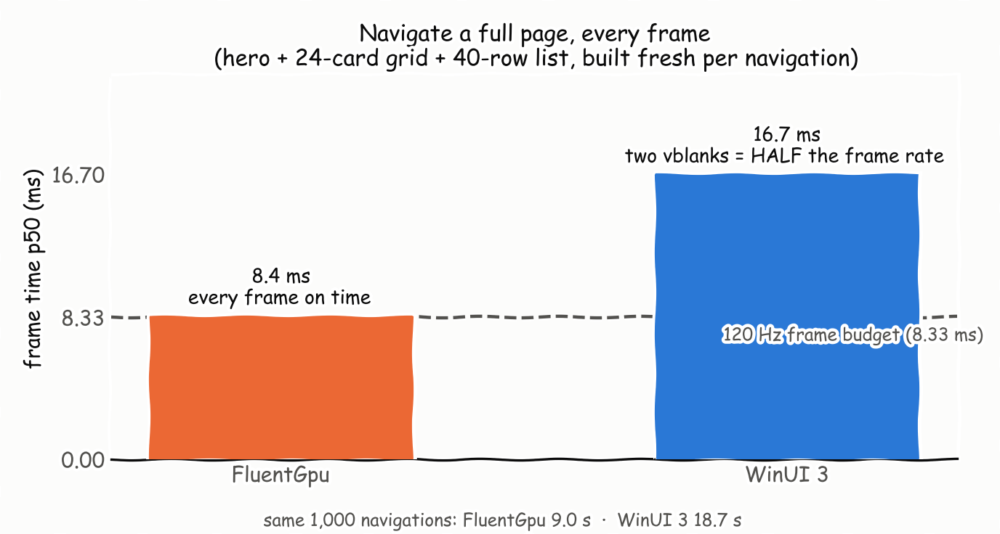
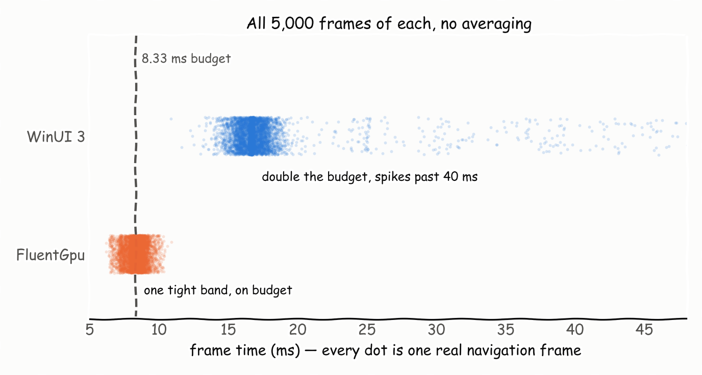
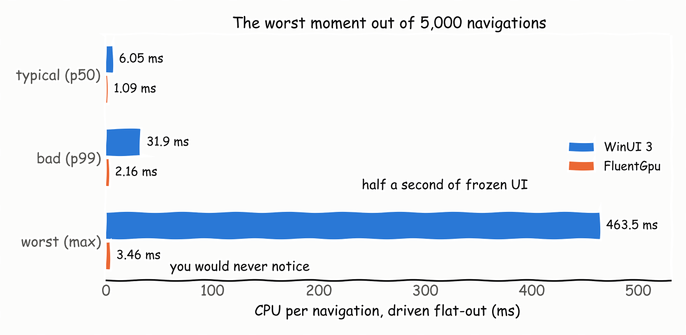
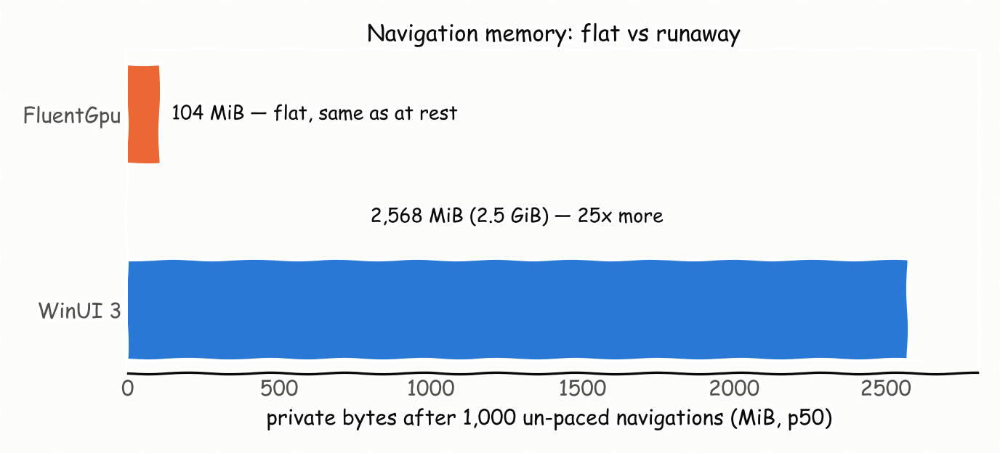
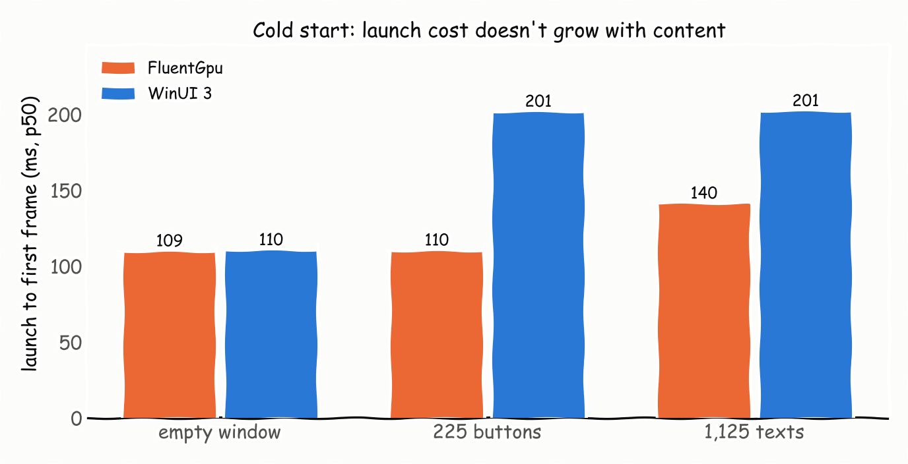
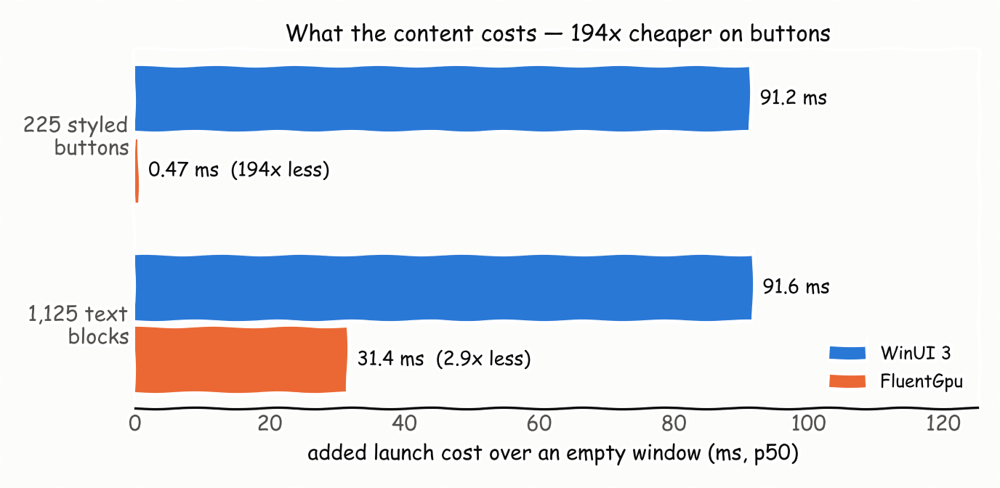
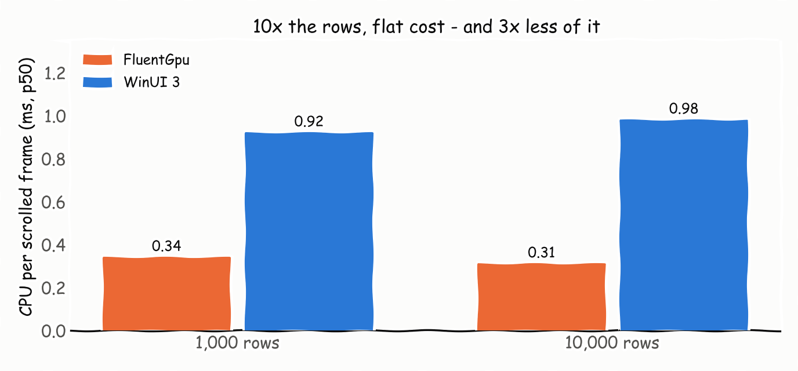

# FluentGPU vs WinUI 3 — same workloads, same machine, receipts included

Two ARM64 .NET 10 **NativeAOT** hosts render pixel-parity workloads — identical 1800×1080 client, identical
content, identical mutation per iteration — alternating launch order, every raw run retained, binaries
SHA-256-verified before every run. **620/620 runs completed. Zero crashes, either framework.**
Full numbers with every caveat: [RESULTS.md](RESULTS.md) · how it's measured: [METHODOLOGY.md](METHODOLOGY.md).

## Navigate a real page: full frame rate vs half frame rate

FluentGPU builds and presents a complete page (hero + 24-card grid + 40-row list, fresh every navigation)
inside a single 120 Hz refresh. WinUI 3 needs two.



No averaging tricks — here is every individual frame from all five display-paced runs of each host:



| Per navigation (display-paced) | WinUI 3 | FluentGPU | Gap |
|---|---:|---:|---:|
| Frame time p50 | 16.69 ms | **8.37 ms** | **2.0× — half vs full frame rate** |
| Frame time p99 / worst | 42.9 / 64.3 ms | **9.97 / 10.9 ms** | 4.3× / 5.9× |
| CPU p50 / p99 | 6.25 / 20.5 ms | **1.10 / 2.07 ms** | 5.7× / 9.9× |
| 1,000 navigations, wall clock | 18.7 s | **8.96 s** | 2.1× |

Driven flat-out (un-paced), WinUI's worst navigation hits **463 ms** and its memory runs away; FluentGPU's worst
is 3.5 ms and its memory doesn't move:





## Content is nearly free

Launch cost stays flat as the app grows — the *content* of a 225-button screen costs FluentGPU **0.47 ms**
on top of an empty window. WinUI pays 91 ms for the same screen.





## Steady-state work, display-paced

| Per-frame CPU p50 (cadence pass) | WinUI 3 | FluentGPU | Gap |
|---|---:|---:|---:|
| Scroll a 10,000-row virtualized list | 0.98 ms | **0.31 ms** | **3.2×** — and FluentGPU's span *includes* record + command-build + submit; WinUI's is mutation + layout only¹ |
| Scroll, 1,000 rows | 0.92 ms | **0.34 ms** | 2.7× |
| Swap a 499-node subtree | 2.38 ms | **0.70 ms** | **3.4×** |



Both frameworks hold vsync on trivial single-node mutations — that's the floor, and either engine clears it.
The gap opens exactly where apps actually spend their time: building, churning, and scrolling real content.

## Where WinUI 3 wins — printed just as large

| Category | WinUI 3 | FluentGPU |
|---|---:|---:|
| Idle memory floor (empty window) | **74 MiB WS / 37 MiB private** | 105 / 88 MiB |
| Frame-time p90/p99 on trivial mutations | **~8.45 ms** | ~9.4 ms (~1 ms wider) |
| Measured managed alloc per navigation² | **135–160 KB** | 270 KB |

¹ The in-app CPU spans differ by construction (WinUI's compositor works off-thread, unmeasured here); the
frame-time rows are the like-for-like verdict. Carried as a caveat on every affected row in `summary.json`.
² FluentGPU's Element trees are managed objects; WinUI's XAML tree is largely native/COM and invisible to
`GC.GetAllocatedBytesForCurrentThread` — a counter-visibility caveat, not a win for either side.

Charts: matplotlib `plt.xkcd()`, generated from `results/wavee1-*` and `results/waved-*` (schema v4).
Cold-start absolutes cite the quiet-machine `waved` dataset; navigation and allocation cite `wavee1`
(taken under ambient media playback — elevates both sides ~10% equally, ratios unaffected; see RESULTS.md).

---

## Reproduce it

This is a standalone, application-free comparison (Wavee is not linked into either host). The runner alternates
launch order, retains every raw run, records non-zero exit codes, hashes the exact WinUI binary
(`Microsoft.WindowsAppSDK` 2.3.1, public stable), and archives the current FluentGPU engine patch. Generated
captures live under `results/` and are intentionally ignored by Git.

> **Schema break: results are `fluentgpu-framework-bench/v2`, summaries `fluentgpu-framework-bench-summary/v4`.**
> The measurement itself changed, not just the file shape: the cold-load start anchor moved to a module initializer
> on both hosts, WinUI's cold-load stop point moved to the second `CompositionTarget.Rendering` callback, the raw
> CPU pass runs one iteration per dispatcher callback, and the localized-transform mutation goes through the XAML
> property system instead of a composition `Visual.Offset`. **Older `results/` directories (v1/v3) are not
> comparable — never mix v3 and v4 numbers in the same table or claim.**

Build the pinned public WinUI release baseline and both NativeAOT hosts:

```powershell
.\benchmarks\FrameworkComparison\scripts\build-release.ps1
```

Run the raw CPU/allocation suite:

```powershell
.\benchmarks\FrameworkComparison\scripts\run-suite.ps1 -Pass cpu
```

`run-suite.ps1` verifies the release hashes written by `build-release.ps1` and archives that evidence beside every
summary. It deliberately refuses ad-hoc `bin/` hosts: those are useful diagnostics, not publishable comparisons.

Run display-paced cadence separately:

```powershell
.\benchmarks\FrameworkComparison\scripts\run-suite.ps1 -Pass cadence -Repetitions 1
```

Capture mutation → desktop-visible latency with the frame-ID color probe (preferred cross-framework visibility metric):

```powershell
.\benchmarks\FrameworkComparison\scripts\capture-frame-id.ps1 `
  -Executable .\benchmarks\FrameworkComparison\FluentGpuBench\bin\Release\net10.0\win-arm64\FluentGpuBench.exe `
  -Framework FluentGpu -Scenario virtual-scroll-10k `
  -OutputDirectory .\benchmarks\FrameworkComparison\results\frame-id
```

Capture displayed cadence / GPU busy / present intervals with PresentMon:

```powershell
.\benchmarks\FrameworkComparison\scripts\capture-presentmon.ps1 `
  -Executable .\artifacts\framework-comparison\publish\FluentGpu\FluentGpuBench.exe `
  -Framework FluentGpu -Scenario virtual-scroll-10k `
  -OutputDirectory .\benchmarks\FrameworkComparison\results\presentmon `
  -PacingTrace
```

`-PacingTrace` writes a FluentGPU-only JSONL trace beside the summary; it correlates each benchmark frame with the
publish/present-ack sequence, UI phase timings, DXGI/DWM counters, and phase-gate escapes.

Use `capture-gpu-memory.ps1` for UMA-aware memory sampling and elevated `capture-wpr.ps1` for CPU, GPU,
ResidentSet, Heap, and WinUI XAML-provider traces. See [METHODOLOGY.md](METHODOLOGY.md) before interpreting ratios.
