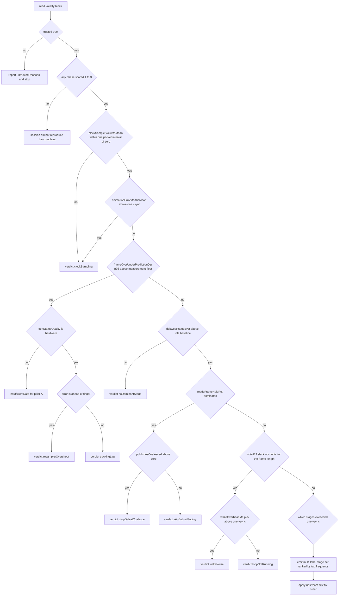

# Wavee scroll-feel diagnostics — implementation plan + diagnosis rubric

Status: **plan, not landed.** Nothing in this document has been built or build-verified. Every "verify" step is a
checklist **for the repo owner to run himself**; no agent has run `dotnet build`, `dotnet run`, or a publish script for
this plan, and no claim below may be restated as "verified working".

Supersedes: the 9-task draft ("Wavee Scroll-Feel Diagnostics", T1–T9) reviewed 2026-07-25. Where this plan disagrees
with the draft, this plan wins; §11 records the disagreements that are still open decisions.

Every `file:line` citation in this document was opened and confirmed against the working tree at `d082d67` +
uncommitted `ops/scratch` artifacts. Claims from the recon that did **not** hold are called out explicitly (§2.4).

---

## 1. Purpose, problem statement, and what "done" means

### 1.1 The problem, in one sentence

**Wavee reports high UI-loop FPS while scrolling feels wrong**, and no artifact in the repo can currently say whether
the fault is on the input side (content not glued to the finger) or the present side (photons not arriving on an even
cadence), because the engine records no present timestamp, no frame identity across the render seam, and no shared
clock between its three diagnostic streams.

The loop already tells us loop-FPS is the wrong number to look at. `FrameStats.Fps` documents itself at
`src/FluentGpu.Engine/Hosting/AppHost.cs:49-51` as UI/frame-loop cadence, "not necessarily on-screen cadence when
submit/present runs asynchronously or frames coalesce". Every `[fps]` line already prints three different cadences
(`loop Xfps`, `present Yfps`, `wait <kind><ms>` — `src/FluentGpu.Windows/Hosting/FluentApp.cs:294-297`). The gap is not
"we have no numbers"; it is that the numbers we have are **unjoinable, unfalsifiable, and partly structurally zero**.

### 1.2 The two pillars (kept from the draft — this framing is correct)

| Pillar | Question | Chain |
| --- | --- | --- |
| **A — glued** | Does the content sit where the finger is? | OS packet → producer queue → engine ring → latch/resample → offset commit |
| **B — steady** | Do photons change on an even cadence? | offset → record DrawList → PUBLISH → render thread submit → Present → vblank |

They are kept **structurally separate** in every artifact and joined only by an explicit token. Every industry model
does this (Chromium `EventLatency` vs `ScrollJank`; Android `on_time_finish` vs `present_type`; Apple frame rate vs
hitch time ratio) for a hard reason: **interventions trade one against the other.** A pacing queue improves cadence and
worsens latency; a fused "smoothness score" would call that a wash.

### 1.3 What "done" means

Done is **not** "scroll is fixed". Done is: **one session bundle, produced by one guided interactive capture, that is
adequate to localize the fault to a subsystem on BOTH pillars — or to state honestly that it cannot.**

Concretely, the plan is done when a single bundle can answer all eight, each with a number or an explicit
`insufficientData` marker, never a 0 standing in for "not measured":

1. Pillar A: what was the signed offset error versus the real finger curve at expected-present time, per gesture, in
   DIP and in ms, split into content-behind-finger and content-ahead-of-finger?
2. Pillar A: was the offset that got baked into frame N sampled at a time that corresponds to when frame N was
   *displayed*, or to when frame N *started*?
3. Pillar B: how many refresh slots did we miss while input was demonstrably available, as a count and as a
   longest-run?
4. Pillar B: for each missed slot, was it "we were slow" or "a ready frame was held"?
5. Which engine stage exceeded one refresh period on the frames that missed their deadline — as a multi-label set with
   counts and coverage, not a single winner?
6. What is the observer cost of the instrumentation, measured, versus a plain-Release arm of the same gesture script?
7. Did the human actually reproduce the complaint in this session (subjective 1–5 per phase)?
8. Is the capture itself trustworthy (ETW loss, ring wrap, present-mode changes, VRR, idle CPU, thermal drift)?

If the bundle answers 1–8 and the rubric in §10 declines to name a suspect, **that is a successful run** — it means the
session did not reproduce, and the protocol says so instead of inventing a verdict.

---

## 2. What already exists

### 2.1 Reusable signals (all confirmed by opening the file)

| Signal | Where | Gate | Notes |
| --- | --- | --- | --- |
| `[fps]` line: loop fps, FrameMs, flush/rx/vr/layout/anim/record/submit ms, `present Nfps seq=`, `gpu <fenceWaitMs>ms`, `wait <kind><ms>`, `WxH@Hz`, `(fN)` | `src/FluentGpu.Windows/Hosting/FluentApp.cs:294-298` | `FG_FPS_LOG` (`Diag.EnvFlag`; **works in plain Release**) | Emission gate is `spike \|\| n % 30 == 0` at `:276` |
| `[fps]` hitch tail: `comps= nodes=/ pump=ms apply=count/KB realize=ms escapes= spans=R/B/RR reasons=0x gc0/1/2` | `FluentApp.cs:284-288` | same | `reasons=0x` names the *cause* of a re-record; the draft never mentions it |
| `WaitTok` mapping incl. `pace-skip` / `pace-async` | `FluentApp.cs:205-215`, printed `:297` | same | **already exists** — draft T2 re-specified it |
| `[fps resize] WxH scale state panel Hz wait` | `FluentApp.cs:230` | same | fires once per client-size change only |
| SPIKE gate: `(flush+layout+record) > 11.0` OR `Presented && gpuMs > max(11, vsyncMs*1.5)` | `FluentApp.cs:232-238` | same | duration-based against a hardcoded 11ms; no deadline model |
| `[scrollperf] frames= clipE= clipD= fullHide= pinD= morphD= contD= bindsMax=` (1 Hz) | `FluentApp.cs:249-275`; counters `src/FluentGpu.Engine/Animation/ScrollBindEval.cs:22` | `FG_SCROLL_PERF` (plain Release) | this **is** the `scrollBindThrash` bucket |
| `[wakediag] run N rendered N \| reconciled N layout N recordOnly N \| streak … kept: … sole: …` (1 Hz) | `src/FluentGpu.Engine/Hosting/WakeDiagnostics.cs:110-144` (line at `:120`) | `FG_WAKE_DIAG` (plain Release) | the reconciled / layout-only / record-only 3-way split |
| `[render-census] flush= rx= vr= comps= scroll= top=Type×N,…` | `src/FluentGpu.Engine/Reconciler/Reconciler.cs:261` | `FG_RENDER_CENSUS` (plain Release) | **suppressed unless `flushMs >= 12.0` OR `comps >= 25`** (`:256`) |
| `[OFFSET-JUMP] old->new req= max= phase= content= vp=` (>60 DIP single write) | `src/FluentGpu.Engine/Input/InputDispatcher.cs:3506-3507`; flag `:3398` | `FG_OFFSET_JUMP == "1"` **exact string** (plain Release) | `'true'`/`'on'` silently disable it |
| `[renderbudget]` SLOW / EVERY-FRAME re-render roster | `src/FluentGpu.Engine/Hosting/RenderBudget.cs:31-39` | `CompiledIn = DEBUG \|\| FLUENTGPU_DIAG` **and** `FG_RENDER_DIAG` | **dead in every publish today** |
| ScrollTrace CSV ring: header `tMs,frame,kind,i0,i1,i2,f0..f5,auxMs` | `src/FluentGpu.Engine/Foundation/ScrollTrace.cs:370`; ring `1<<17` at `:102` | `FG_SCROLL_TRACE` **and** `DEBUG \|\| FLUENTGPU_DIAG` | `On` is `public const bool On = false` in plain Release (`:64`) |
| `FG_SCROLL_TRACE` doubles as a **path**: any value ≠ `"1"` is used verbatim | `ScrollTrace.cs:101` | same | launcher writes `scroll.csv` straight into the session dir, no new env var |
| `ScrollTraceKind` 0..17, all defined, `FrameTiming = 17` last | `ScrollTrace.cs:10-31` (`:29` = FrameTiming) | same | **next free ordinal = 18** |
| `s_kindNames` — exactly 18 strings, ends `"frameTiming"` | `ScrollTrace.cs:354-359` | same | indexed **unguarded** at `:380` inside a swallow-all `catch` (`:389`) that then zeroes `s_count` (`:390`) |
| `ScrollTrace.Note(code, f0, i1, i2, f1)` — **not** `[Conditional]`, callable from app code | `ScrollTrace.cs:266-270`; app precedent `src/apps/Wavee/Features/Home/HomePage.cs:494` | `On` | phase markers need no new record kind |
| `FrameTiming` row: f0..f5 = flush/layout/anim/record/submit/fenceWait, i0 = presentMs×100, i1 = `(measure<<10)\|min(shapeMisses,1023)`, i2 = **unclamped** dt×100 | `ScrollTrace.cs:276-287`; emitted `AppHost.cs:2481-2487` | `On && dtMs > 12f` | already covers most of draft T2 |
| Note **113** = hitch slack + GC deltas + last requested wait | `AppHost.cs:2492-2497` | same | the "loop wasn't running" vs "work was slow" discriminator |
| `OffsetWrite` row (i0=node, i1=`ScrollState.Phase`, i2=`ScrollWriter`, f0=offset) | emitted `InputDispatcher.cs:3521`; method `ScrollTrace.cs:306-332` | `[Conditional(DEBUG/FLUENTGPU_DIAG)]` | plus a **0-alloc always-available audit** (`Audit*`) used by `gate.scroll.single-writer` |
| `Phase` row carries accum-before at f2/f3, this packet's delta at f0/f1, packet QPC in `aux` | `InputDispatcher.cs:2938-2941` | `On` | in2off is derivable **offline** from this |
| `Latch` row carries the resampler anchor | `InputDispatcher.cs:3099-3103` | `On` | |
| Ring coalescing traced (`Coalesce`) + overwritten packet pushed to velocity side ring | `src/FluentGpu.Engine/Seams/Pal/Pal.cs:192-230` | `On` | wheel by `(Pointer,PointerId)`, ScrollUpdate/MomentumUpdate identically |
| `InputEvent.QpcTicks` — per-packet OS stamp, **same clock domain as Stopwatch** | `Pal.cs:120`; domain published `src/FluentGpu.Windows/Pal/Win32Platform.cs:54` | always compiled | so packet QPC, ScrollTrace `tMs`, and any DXGI `SyncQPCTime` are directly comparable |
| Hi-res wheel branch already resolves `POINTER_INFO.PerformanceCount` and puts it on the event | `Win32Platform.cs:1466-1468`, enqueued `:1489-1492`, traced into `aux` `:1476-1479` | always compiled | **stamp A already exists on this path** |
| `Decode()` reads `dwTime` + `PerformanceCount` for every WM_POINTER contact | `Win32Platform.cs:1822-1825`; struct `:350-361` | always compiled | `ptPixelLocation` is OS-**predicted** for touch; `ptPixelLocationRaw` is not |
| Tracking-lag inputs already in scope at ONE site: `rawOffset` (resampled implied finger) and applied `off` | `src/FluentGpu.Engine/Animation/ScrollIntegrator.cs:545` and `:548` | always compiled | lag is a **subtraction**, not a reconstruction |
| `ScrollTuning.ResampleLatencyMs = 12f` | `src/FluentGpu.Engine/Animation/ScrollTuning.cs:37` | n/a | the resampler **deliberately** targets `frameT − 12ms` (`ScrollIntegrator.cs:744`) |
| `scrollActive` (the authoritative per-frame bit) | `AppHost.cs:2183` | always computed | **not on `FrameStats`, not public** |
| `PresentedSequence` (monotonic present COUNT), `PresentFps` | `AppHost.cs:959` / `:963`; incremented `:2915` | always on | count only — **no frame identity** |
| `RenderFrame.PublishSeq` — the real per-frame identity across the seam | `src/FluentGpu.Engine/Hosting/Threading/RenderFrame.cs:21`; minted `SceneFramePublisher.cs:63`; acked `RenderThread.cs:103` | always on | `RenderThread.PresentAck` (`RenderThread.cs:65`) is **read by nothing in `src/`** |
| `SceneFramePublisher.PublishSeq` / `LastConsumedSeq`; DropOldest coalesce | `SceneFramePublisher.cs:49` / `:46`; `TryAcquire` `:80-93` (dedup `:89`) | always on | **neither is exposed on `AppHost`; drops are counted nowhere** |
| Skip-submit gate + census `FramesSkippedSubmit` | `AppHost.cs:2298-2323` (`_framesSkippedSubmit++` at `:2320`); property `:1123` | always on | **never printed** |
| `HostWaitKind.PaceSkipSubmit` assigned **only** under `!_asyncActive` | `AppHost.cs:1077` | always on | on the async default a real skip-submit frame reports `pace-async` |
| `FG_ADAPTIVE_FPS` governor — **default ON**, engages when smoothed fence-wait EMA > `GpuBoundBudgetMs = 10.0` | `AppHost.cs:716`, `:723`, `:1064` | env kill-switch | changes present cadence mid-session; recorded nowhere |
| `FG_SCROLL_PRESENT_INTERVAL0` requires `gpuRenderMs > 0` ⇒ requires `FG_GPU_TIMING` | `AppHost.cs:720`, `:2336-2338` | env | not an independent switch |
| Wavee `AmbientFps = 60`; `AppHost.cs:680` warns a 60 cap under a 120 Hz panel **beats** against the vsync-locked present | `src/apps/Wavee/Program.cs:266`; warning `AppHost.cs:680` | n/a | a cadence verdict computed without this reads the beat as a present defect |
| `FG_OPAQUE_WINDOW` A/B — rewrites `AppOptions.Mica` | `FluentApp.cs:99-103`, inside `#if DEBUG \|\| FLUENTGPU_DIAG` (`:94`) | diag build only | **dead in a plain Release publish**; and it IS a behaviour fork |
| `FG_DIAG` / `FG_DIAG_CONSOLE` both set `Diag.Enabled` + `Diag.Sink = Console.Error` | `FluentApp.cs:106-111` | diag build only | no events-only mode |
| `FG_GPU_TIMING`: 3 unconditional `EndQuery` + up to **256** extra from `SceneCat` category boundaries + a **fixed 259-slot** `ResolveQueryData` every frame | `src/FluentGpu.Windows/D3D12/D3D12Device.cs:854-868`, `:983-992`, `SceneCat` `:2228-2239` | `FG_GPU_TIMING` (plain Release) | boundary count **peaks** on a dense fill→image→glyph list — exactly during the fling |
| Swapchain: `FLIP_DISCARD`, `BufferCount = FRAME_COUNT = 2`, latency-waitable always, `SetMaximumFrameLatency(1)` | `D3D12Device.cs:26`, `:585`, `:602-603` | always | the real deadline is `bufferCount × refreshPeriod`, not 16.7ms |
| `Present()` chokepoint, render-confined (`AssertSubmitThread` at `:2112`) | `D3D12Device.cs:2126` | always | the only correct place to sample `GetFrameStatistics` |
| `LastFenceWaitMs` — wall time around `WaitForLatency + WaitForFrame` at the TOP of `SubmitDrawList` | `D3D12Device.cs:842-847`, property `:2168` | always | written on the render thread, re-read UI-side a frame later ⇒ **cross-frame** |
| Device-lost breadcrumb ring — 64-entry per-frame POD snapshot, unconditional | `AppHost.cs:611-628`, called `:2314-2315` | always | the in-repo precedent for a per-frame POD ring's shape and cost |
| `gate.scroll.contact-1to1` — asserts applied offset within 0.5 DIP of the **resampled** position | `src/FluentGpu.VerticalSlice/Suites/ScrollSuite.cs:1518`, math `:1514` | headless gate | uses `vel * (present − ResampleLatencyMs − t0)` — the correct comparand |
| `Gate.Check(name, ok, detail)`; suite tag `diagnostics` already registered | `src/FluentGpu.VerticalSlice/Harness/Gate.cs:46-51`; `Harness/SuiteRegistry.cs:54` | n/a | no registry edit needed for a new gate |
| Proven stderr-tee pattern: save `$ErrorActionPreference`, set `Continue`, `& $exe *>&1 \| Tee-Object -FilePath $log \| Out-Host`, restore in `finally` | `ops/build/bench-wavee.ps1:43-50` | n/a | the pipeline is also what makes PowerShell **wait** for a WinExe |
| `publish-wavee-aot.ps1` — `-Arch`/`-Configuration`/`-Symbols`, `$pubArgs` array | `ops/build/publish-wavee-aot.ps1:10-16`, `:45-52` | n/a | where `/p:FluentGpuDiag=true` appends |
| Intel PresentMon **2.5.1** installed | `%LOCALAPPDATA%\Microsoft\WinGet\Links\presentmon.exe` (symlink into `Intel.PresentMon.Console_…`) | n/a | x64 binary — see §6.3 |
| Native ARM64 `xperf.exe`, `wpr.exe`, `wpa.exe`, `wpaexporter.exe`, `gpuview/GPUView.exe` | `C:\Program Files (x86)\Windows Kits\10\Windows Performance Toolkit\` | n/a | recording with no emulation overhead |

### 2.2 Note-code registry (confirmed in use)

| Code | Meaning | Emitter |
| --- | --- | --- |
| 100 | anchor re-pin (i1=node, i2=anchorIndex, f0=delta, f1=offset) | `src/FluentGpu.Engine/Layout/FlexLayout.cs:769` |
| 101 | resampler hit the no-extrapolation clamp | `ScrollIntegrator.cs:782`, `:812` |
| 102 / 103 | pending anchor shift folded into live anchor / drained with no tracked gesture (ternary) | `ScrollIntegrator.cs:361` |
| 104 | stale pre-latch shift discarded | `ScrollIntegrator.cs:287` |
| 110 | HomePage extent-table reseed | `src/apps/Wavee/Features/Home/HomePage.cs:494` |
| 111 | per-row extent correction | `FlexLayout.cs:821` |
| 113 | hitch slack + GC deltas + last requested wait | `AppHost.cs:2495` |

**Next free code is 105** (also 106–109, 112, ≥114). The doc comment at `ScrollTrace.cs:265` documents **only**
100/102/103/104 — 110/111/113 are undocumented drift. Any new code must be registered there in the same commit.

### 2.3 Confirmed genuinely absent from `src/`

- `GetFrameStatistics`, `GetLastPresentCount`, `SyncQPCTime`, `PresentRefreshCount`,
  `DwmGetCompositionTimingInfo`, `DCOMPOSITION_FRAME_STATISTICS` — **zero hits** in `src/**/*.cs`.
- `ScrollLatencyProbe` — **zero hits** in `src/`. It is pre-specified but unbuilt at
  `docs/plans/scroll-feel-rework-design.md:448` (three stamps: packet enqueue / DrawList record / render-thread
  present) and referenced at `docs/plans/scroll-feel-rework-v2-design.md:316` with the caveat
  *"honest accounting: async present adds ≥1 frame"*. **This plan's stamp B is the offset-commit chokepoint, not
  DrawList record** — a deliberate deviation from the v1 design's middle stamp, stated here so the built probe is
  reconcilable with the design docs.
- `FLUENTGPU_DIAG` / `FluentGpuDiag` in any `.csproj` / `.props` / `.targets` / `.ps1` / `.slnx` / `.yml` —
  **zero hits**. The only tree matches are `docs/site/api/FluentGpu.Foundation.Diag.yml` (generated API docs) and 10
  `.cs` files using the symbol in `#if` / `[Conditional]`.
- `ops/diag/` — does not exist (`ops/` = `build`, `packaging`, `scratch`, `scripts`, `tools`).
- Any parser for `[fps]` or `scroll.csv`.
- Nothing under `ops/` is gitignored: `git check-ignore -v ops/diag/sessions/x/console.txt` → exit 1, no output.

### 2.4 Factual errors in the draft and in the recon — corrected

**Draft errors (do not carry these forward):**

1. **"Past full diag runs were incomplete" is FALSE.** `ops/scratch/hitch-measure-20260723-191423.scroll.csv` is a
   real diag-compiled capture: 9738 rows, **2040 `offsetWrite` rows**, and `ScrollTrace.OffsetWrite` is
   `[Conditional("DEBUG"), Conditional("FLUENTGPU_DIAG")]` (`ScrollTrace.cs:306`). With `On` const-false the file
   would never have been created at all. The verifiable premise is narrower: **no tracked file defines
   `FLUENTGPU_DIAG`, so a publish from HEAD erases it.**
2. **Stamp C as drafted is not implementable.** "When `PresentedSequence` advances for the frame carrying that offset"
   — `NotePresented()` is a bare `Interlocked.Increment` with no frame identity (`AppHost.cs:2915`), and the only
   present-adjacent timestamp is `_actualPresentTimes[_actualPresentTimeNext] = now` (`AppHost.cs:2960`), a **UI-thread**
   read taken from `UpdateFrameTiming` (`:2917-2921`) during phase 12 of the **following** frame. Under async the real
   `Present()` ran earlier on the render thread. See §3.3 and §7-T4.
3. **T4's `|lag| > 0.5 DIP` tripwire fires on every healthy frame.** `ScrollTuning.ResampleLatencyMs = 12f`
   (`ScrollTuning.cs:37`), and `ScrollIntegrator.cs:744` targets `frameQpcSec − ResampleLatencyMs/1000`. That is
   **24 DIP of structural lag at 2000 DIP/s**. Four in-code comments still say 5ms and will mislead an implementer:
   `ScrollIntegrator.cs:529`, `ScrollIntegrator.cs:535`, `AppHost.cs:2167`, and the gate message string at
   `ScrollSuite.cs:1518`. (The critiques listed three; the ScrollSuite one is a fourth.) Fix all four in the same
   commit as the sensor.
4. **T2 largely re-specifies shipped output.** `record`/`submit` ms, `gpu <fenceWaitMs>`, `spans=R/B/RR` + the causal
   `reasons=0x` mask, `pump=`/`apply=count/KB`/`realize=`, and the `pace-skip`/`pace-async` wait token are all already
   on every `[fps]` line (`FluentApp.cs:284-298`). T2's real content is three things: the **emission cadence** gate at
   `:276`, a **timestamp prefix**, and a **`ScrollActive` bit** to gate on.
5. **`presentDeltaSeq` is not new plumbing.** `host.PresentedSequence` (`AppHost.cs:959`) is already a live always-on
   monotonic counter; one `ulong prev` local yields the delta. The real defect is orthogonal: `[fps]` reads
   `s.PresentedSequence`/`s.PresentFps` from `FrameStats`, and **five** early-out paths construct
   `new FrameStats(0, …, Rendered: false)` leaving both at 0 — `AppHost.cs:606` (device-lost recover), `:1712` (window
   closed), `:1757` (device-lost block), `:1782` (minimized), `:1818` (idle gate). Those frames emit
   `present 0fps seq=0`. **This is the mechanical root cause of the recorded "present 0fps is a sampling artifact"
   history**, and it is a one-line fix (print `host.PresentedSequence` / `host.PresentFps` instead). A second
   contributor: `PresentFps` is forced to `0.0` whenever no sequence advance is observed inside the 1.0 s window
   (`AppHost.cs:2954`, `FpsWindowSeconds` at `:674`).
6. **T1 needs TWO props edits, and the project list omits `FluentGpu.Controls`.**
   `src/apps/Directory.Build.props:3-6` states verbatim that `src/apps/` "does NOT inherit
   src/Directory.Build.props" and hand-mirrors it. And `[Conditional]` erasure is decided by the **calling** assembly:
   `src/FluentGpu.Controls` has 5 `Diag.Event` call sites (`NavigationView.cs:327`, `Slider.cs:436/448/487/494`) that
   stay erased if only Engine+Windows+Wavee get the symbol.
7. **`FG_DIAG` is not low-observer in a diag build.** `Diag.Count`/`Set` do `category + "." + key` string concat plus
   `value?.ToString()` boxing under one process-global `lock (Gate)` (`Diag.cs:64-77`). `D3D12Device.cs:941-978`
   fires ~20 of them per frame inside the submit path — on the **render thread** under async — plus more in
   `ImageCache` and `DecodeScheduler`. `FG_DIAG_CONSOLE` is identical (`FluentApp.cs:106`).
8. **T5's per-frame file poll breaches the alloc contract.** A `File.Exists`/`ReadAllLines` near `AppHost.cs:2165` sits
   inside the phases 6–13 zero-alloc window that `gate.alloc.steady-zero`
   (`src/FluentGpu.VerticalSlice/Suites/DiagnosticsSuite.cs:355`) and `gate.scroll.alloc-zero` (`ScrollSuite.cs:1899`)
   enforce. Nothing in the engine touches the filesystem per frame today.
9. **"Probes zero-cost when off" is too broad.** True for ScrollTrace / Diag / RenderBudget (compile-time
   `const false` or `[Conditional]`-erased). **False** for `FG_OFFSET_JUMP` (`InputDispatcher.cs:3398` — a plain
   `static readonly bool`, one branch per offset write, always compiled), `FG_SCROLL_LOG` (`ScrollLog.cs:20`),
   `FG_SCROLLLOG` (`SceneRecorder.cs:60`), `FG_SCROLL_PERF` (`ScrollBindEval.cs:22`). Narrow the claim to:
   **erased when compiled out; one well-predicted branch when compiled in and disabled.**
10. **T8's scratch-bat characterisation is wrong.** `ops/scratch/run-wavee-hitch.bat` sets `FG_GPU_TIMING=1` and
    `FG_DIAG=1` but **not** `FG_MEM_DIAG`, and targets the JIT dir `bin/Release/net10.0`, not a publish. All three bats
    are **untracked**, so "retire" is really "replace an untracked path with a tracked one" — do not claim
    `ops/diag/README.md` supersedes tracked tooling.
11. **T8's WaveeNavProbe framing needs the mechanism.** It calls `SuppressLatencyWaitOnce()` +
    `SuppressVsyncOnce()` per measured frame (`src/apps/Wavee/Features/Diagnostics/WaveeNavProbe.cs:629`) unless
    `WAVEE_PROBE_VSYNC` (`:617`) — it **deliberately removes the present path**, which is *why* it structurally cannot
    see present cadence, DropOldest, or photon smoothness. It is also not a blank slate: `AppendScrollVerdicts`
    (`:936`, invoked `:925`) already classifies the same `FrameStats` segments and `Pct` (`:2449`) already formats
    p50/p90/p99/p99.9 tables (`:871`). Two divergent rubrics for one signal set is the single-owner violation
    `CLAUDE.md` warns about — §11-Q4 names an owner.

**Recon claims that did not hold as stated:**

- The critique cited `frameTiming` means of `submit 8.303ms` / `fenceWait 7.644ms`. Recomputed over all 429
  `frameTiming` rows: **flush 0.461 / layout 0.118 / anim 0.039 / record 0.687 / submit 7.514 / fenceWait 6.924 ms.**
  The conclusion is unchanged and stronger: **92% of submit is fence wait.**
- The critique said "four idle `FrameStats` constructions". There are **five** — `AppHost.cs:606` was missed.
- The recon cited app-side direct offset writers at `PlaylistInlineEdit.cs:274` and `LyricsView.cs:1151`. **Could not
  verify**: `src/apps/Wavee/Features/Lyrics/LyricsView.cs` does not exist at that path and `PlaylistInlineEdit.cs` has
  no matching write. Those two citations are dropped; the engine/controls list in §7-T5 is confirmed.
- `--write_display_metadata` is **rejected** by the installed PresentMon 2.5.1 (probed). `--track_etw_status`,
  `--write_frame_id`, `--write_display_time`, `--track_app_timing`, `--qpc_time`, `--v1_metrics`, `--v2_metrics`,
  `--scroll_indicator`, `--restart_as_admin` are all **accepted** (probed), despite some being absent from `--help`.

### 2.5 What the already-committed capture says today (zero new code)

Computed directly over `ops/scratch/hitch-measure-20260723-191423.scroll.csv`:

- **4151** `frame` rows, **429** `frameTiming` rows ⇒ **10.33%** of recorded frames exceeded 12 ms.
- **164** Note-113 rows (slack > 12 ms) ⇒ **~38% of those hitches were "the loop was not running"**, not "work was slow".
- **submit 7.514 ms mean vs fenceWait 6.924 ms mean** ⇒ submit is almost entirely fence wait.
- **136** Note-111 per-row extent corrections + **3** Note-100 anchor re-pins ⇒ live layout churn during scroll.
- Worst unclamped `dt` in the `frameTiming` i2 column: **59 050 ms** — an idle gap, not a hitch. Any parser that reads
  that column without a scroll-active gate will fabricate a catastrophic stall.
- Kind histogram: `frame 4151, offsetWrite 2040, animTick 2040, frameTiming 429, rawWheel 386, wheelSeed 383, note 308`
  — and **zero** `phase`/`latch`/`coalesce`/`velSample`/`release`/`gestureEnd` rows. **The capture is wheel-only.**
  The touchpad/contact path is the genuine gap and is where the first NEW capture must aim.
- `ops/scratch/hitch-measure-20260723-191423.console.txt` has **476 `[fps]` lines and 0 `scrolltrace` lines** —
  because the bat used `2>` and the `[scrolltrace] writing to …` banner goes to **stdout** (`ScrollTrace.cs:105`).
  Proof that the launcher must use `*>&1 | Tee-Object`.

---

## 3. Metric definitions

This is the heart of the plan. **Every emitted signal is a predicate or a formula with units in its name.** Labels
("MISMATCH", "RENDER", "spike") are banned — two runs of a label are not comparable.

Conventions: all times are integer QPC ticks internally; `qpcFreq = Stopwatch.Frequency`
(`Win32Platform.cs:54` publishes the same value as `SystemParams.QpcFrequency`, so packet stamps, ScrollTrace `tMs`,
and DXGI `SyncQPCTime` share one axis). `vsyncTicks` comes from `DWM_TIMING_INFO.qpcRefreshPeriod`, cross-checked
against `DCOMPOSITION_FRAME_STATISTICS.currentCompositionRate` — **never** from
`Win32Platform.CurrentRefreshHz()` (`:333-339`), which is nominal `GetDeviceCaps(VREFRESH)`, returns 0 when the driver
reports 0/1, and is re-sampled only on client-size change (`FluentApp.cs:229`).

`N` indexes **presented** frames within one phase unless stated. Percentiles are computed at the packager, never in-frame.

### 3.1 Present-cadence family (pillar B)

**M1 — `jankyPresent` (borrowed verbatim: Chromium scroll-jank-v3, `cc/metrics/scroll_jank_dropped_frame_tracker.cc`)**

```
presentIntervalTicks[N] = presentQpc[N] - presentQpc[N-1]
jankyPresent[N] = (presentIntervalTicks[N] > vsyncTicks * 3 / 2)
              AND (firstInputGenQpc[N] - lastInputGenQpc[N-1] < vsyncTicks * 3 / 2)
```

Units: boolean. Window: per phase and per fixed 64-presented-frame window. **Clause 2 is mandatory.** Without it every
finger lift, wheel-notch gap and OS packet stall becomes a fabricated render fault — and the §2.5 evidence shows this
concretely (a 59 s "frame"). **Exclude `N` = the first present of each window/gesture**: it is structurally never
janky (Chromium seeds its counter to `-1` for exactly this reason).

The **1.5× asymmetry is deliberate and must be preserved**: `1.5 × vsync` **classifies** a frame as janky;
`1.0 × vsync` **attributes** a cause (M11). Getting these the same way round is the most common implementation error.

Stamps needed: `presentQpc` (§4.1 stamp C), `firstInputGenQpc` / `lastInputGenQpc` per present row.
Error bar: `presentQpc` is taken immediately after `_swapchain.Present()` returns — that is *submit-confirmed*, not
vblank-confirmed. Where `DXGI_FRAME_STATISTICS` is available (M2b) the vblank-attested form supersedes it.

**M2 — `missedVsyncs` (same standard)**

```
missedVsyncs[N] = ((presentIntervalTicks[N] + vsyncTicks / 2) / vsyncTicks) - 1      // integer division
```

Units: integer refresh slots. The `+ vsyncTicks/2` half-interval bias before integer division is part of the
definition, not a rounding convenience.

**M2b — `missedVsyncsAttested` (OS-attested; supersedes M2 where available)**

From `IDXGISwapChain::GetFrameStatistics`: keep a queue of `(presentCount → expectedPresentRefreshCount)`; per frame
compare actual `PresentRefreshCount` against expected. `missedVsyncsAttested = actual - expected`.
Error bar and hard constraints: valid for flip-model or fullscreen swapchains only (ours is `FLIP_DISCARD`,
`D3D12Device.cs:578`); `PresentCount` is documented as **not** the number of `Present()` calls, so the correlation must
tolerate holes; returns `DXGI_ERROR_FRAME_STATISTICS_DISJOINT` on the **first** call and after every mode change —
handle it or the first sample of every session is garbage. This is vblank granularity, **not** photons: panel scanout
position and panel response are invisible.

**M3 — `delayedFramesPct`**

```
delayedFramesPct = 100 * jankyPresents / presentedFrames
```

Units: percent. Emitted (a) **per gesture, always**; (b) over a **fixed window of exactly 64 presented scroll frames,
only when the window completes**. A session of only short flicks legitimately produces zero window samples and must be
reported as `insufficientData`, **never as 0%**.

**M4 — `missedVsyncsSum` and `missedVsyncsMax`**

Sum and max-single-frame `missedVsyncs` over the same two units, **reported separately** — frequency vs severity. One
6-slot freeze and six 1-slot drops have identical p95 and feel completely different.

**M5 — `hitchTimeRatioMsPerSec` (borrowed: Apple, `MXAnimationMetric.scrollHitchTimeRatio`)**

```
deadlineTicks       = bufferCount * vsyncTicks                 // bufferCount = FRAME_COUNT = 2 (D3D12Device.cs:26)
expectedPresentQpc  = lastConfirmedPresentQpc + k * vsyncTicks // k = 1 for the next slot
hitchMs[N]          = max(0, presentQpc[N] - expectedPresentQpc[N]) quantised to whole vsyncTicks
hitchTimeRatioMsPerSec = sum(hitchMs) / phaseScrollActiveSeconds
```

Units: hitch-milliseconds per second of **scroll-active** time (not wall time — otherwise the idle phases dilute
everything; Firefox normalises by APZ-active time for the same reason). This is the **headline scalar per phase** and
the only surveyed metric with published perceptual thresholds. Carry Apple's thresholds **labelled as another
platform's**: `< 5` good, `5–10` investigate, `>= 10` act.

Two non-negotiable modelling details: the deadline is `bufferCount × vsyncTicks`, **not 16.7 ms** — with the
render-thread seam plus the `RenderInFlightDepth + 1` quarantine our real deadline is multiple frames, and measuring
against one frame over-reports hitches for this architecture. And under VRR the fixed-period model collapses: compute
against the previous present plus the currently observed period, or emit
`null` + `reasonNotMeasured: "vrr"`.

**M6 — `animationErrorMs` (borrowed: Intel PresentMon `MsAnimationError`) — the metric the draft lacks entirely**

```
animationErrorMs[N] = (offsetSampleQpc[N] - offsetSampleQpc[N-1]) / qpcFreq * 1000
                    - msBetweenDisplayChange[N]
```

where `offsetSampleQpc[N]` is the instant the offset baked into frame N actually represents — derivable from
`_scrollAnim.FrameQpcSec` (set at `AppHost.cs:2170`) minus `ScrollTuning.ResampleLatencyMs` — and
`msBetweenDisplayChange` comes from `PresentRefreshCount` deltas (M2b) or from PresentMon.

Units: signed ms. Report **per-frame scatter, mean absolute, p95, max**, and
`percentAnimationErrorPct = sum(|error|) / totalFrameTimeMs * 2`. **Do not collapse to one average** — signed values
cancel and averaging hides the spikes (the published methodology says so explicitly).

This is the metric for "cadence is perfect, FPS is high, still feels wrong" — i.e. for the plan's own problem
statement. It measures the mismatch between how much simulated motion a frame **baked in** and how much display time
it **occupied**.

**M6b — `clockSampleSkewMs` (the cheapest high-value metric in the plan)**

```
clockSampleSkewMs[N] = (offsetSampleQpc[N] - expectedPresentQpc[N]) / qpcFreq * 1000
```

Units: signed ms. Rationale, and why this is a live suspect rather than a formality: `AppHost.cs:2170` sets
`_scrollAnim.FrameQpcSec = Stopwatch.GetTimestamp() / Frequency` at **phase 7 — frame start** — and the resampler then
targets `frameT − 12 ms` (`ScrollIntegrator.cs:744`). So the sampled instant is **behind frame start**, not ahead to
expected present. Android documents the rule the other way round: the animation clock must be advanced from the
expected presentation time, and frame-start time explicitly must not be used. A systematic non-zero mean here injects
roughly one frame of motion error **with perfect FPS and zero missed vsyncs**. A non-zero mean is a finding, not noise.

**M9 — `frameOverrunMs` (borrowed: Android `frameOverrunNanos`) — SIGNED**

```
deadlineQpc     = expectedPresentQpc - bufferCount * vsyncTicks
frameOverrunMs  = (frameReadyQpc - deadlineQpc) / qpcFreq * 1000
onTimeFinish    = frameOverrunMs <= 0
```

Units: signed ms. Report the **distribution including negative headroom**, never a mean — a healthy mean with a
bimodal tail is the actual failure. This replaces the ad-hoc SPIKE rule at `FluentApp.cs:232-238` (which compares
durations against a hardcoded 11 ms with no deadline model).

**M10 — the cadence cross-product (borrowed: Android FrameTimeline `jank_type`)**

Per frame emit `onTimeFinish` (M9) and `presentType ∈ {early, onTime, late}`:

| `onTimeFinish` | `presentType` | Reading |
| --- | --- | --- |
| false | late | **our render/submit was slow** (AppDeadlineMissed analogue) |
| true | late | **a ready frame was held** by pacing or DropOldest (BufferStuffing analogue) |
| false | onTime | **zero headroom** — will jank under any perturbation |

This replaces the draft's fused rank-1 bucket. Corroborate per phase with `DWM_TIMING_INFO` deltas: `cFramesDropped`
(we were late), `cFramesMissed` (we starved the compositor), `cFramesLate` (DWM's own lateness). Those counters are
**valid only from the second call**, and `hwnd` **must be NULL** since Windows 8.1 (main-monitor-global, no per-window
attribution).

**M-B1 — `coalescedPublishes` and `renderLagFrames`**

```
coalescedPublishesCumulative = PublishSequence - PresentedSequence
renderLagFrames              = PublishSequence - ConsumedSequence
```

Both derive from values that already exist (`SceneFramePublisher.cs:49`/`:46`, `AppHost.cs:959`) and are currently
exposed nowhere. `coalescedPublishes` is the **only** measure of DropOldest drops
(`SceneFramePublisher.cs:80-93`), which nothing counts today.

**M-B2 — `presentsSkipped`**

Delta of `FramesSkippedSubmit` (`AppHost.cs:1123`) between adjacent log lines. A submitted-but-empty or elided frame
**counts as dropped** in Chromium's definition, and that is exactly how the skip-submit path
(`AppHost.cs:2298-2323`) must be scored. Note `FrameStats.Presented = !skipSubmit` is decided at `:2313`, **before**
the render thread does anything — it means "published, not elided", never "photons".

**M-B3 — `presentIntervalMsMeanPlus2Sd` (borrowed: Chromium "Perceived Frame Duration")**

```
presentIntervalMsMeanPlus2Sd = mean(presentIntervalMs) + 2 * stddev(presentIntervalMs)
```

Units: ms. One scalar that balances throughput, outliers and consistency. Report **alongside** the full histogram, not
instead of it — a single percentile cannot distinguish consistent 33 ms frames from one 500 ms frame among fast ones,
and both score identically on p95.

### 3.2 Input-to-photon decomposition (pillar A)

**M12 — the exhaustive stamp chain (borrowed: Chromium `EventLatency` stage model)**

Attribution is only sound if **every tick between input and vblank belongs to exactly one named stage**. If a stage is
unstamped its cost silently accrues to a neighbour and the >1-vsync attribution rule confidently names the wrong
subsystem. Minimum chain, in order:

| Stage stamp | Source | Status |
| --- | --- | --- |
| `genQpc` | `InputEvent.QpcTicks` (`Pal.cs:120`) | exists on WM_POINTER + hi-res wheel; **0 on detented wheel** |
| `ringWriteQpc` | `InputEventRing.Write` (`Pal.cs:166`) | derivable offline: `aux` vs `tMs` in the CSV **today** |
| `latchQpc` | `Latch` row (`InputDispatcher.cs:3099-3103`) | exists |
| `offsetCommitQpc` | the `OffsetWrite` site (`InputDispatcher.cs:3521`) | exists (row); **stamp is new** |
| `wakeQpc` | loop wake, before phase 6 | **new** |
| `recordStartQpc` / `recordEndQpc` | `tAnim` / `tRecord` (`AppHost.cs:2443`) | exists as durations |
| `publishQpc` + `publishSeq` | `SceneFramePublisher.Publish` return (`AppHost.cs:2339` ignores it) | **new** |
| `submitStartQpc` / `submitEndQpc` | render thread | exists render-side, not carried |
| `presentQpc` | after `_swapchain.Present()` (`AppHost.cs:568`) | **new — the only genuinely absent stamp** |
| `presentConfirmedQpc` | DXGI `PresentRefreshCount` → QPC via `SyncRefreshCount`/`SyncQPCTime` | **new, optional** |

`in2off`, `off2present` and `in2present` from the draft survive as **derived sums**, not primitives.

**M12a — `wakeOverheadMs` (borrowed: Flutter `vsyncOverhead`) — its own stage, deliberately**

```
wakeOverheadMs = (recordStartQpc - wakeQpc) / qpcFreq * 1000
```

This separates **"we woke up late"** (pacing / DVFS — the standing suspicion in the smoothness-campaign notes) from
**"we were slow"**. They are two different bugs with two different fixes and the draft cannot distinguish them.
The existing Note-113 slack discriminator (`AppHost.cs:2495`) is the coarse version of the same idea and should be
kept as the cross-check.

**M-A1 — `inputToVblankOfPresentMs` (NOT "photons")**

```
inputToVblankOfPresentMs = (presentConfirmedQpc - genQpc) / qpcFreq * 1000
```

Units: ms. **Name it `inputToVblankOfPresent`, never `inputToPhoton`.** No software technique sees panel scanout.
Honest error budget, to be written verbatim into `ops/diag/README.md`:

- **0–8 ms unmeasured device-to-host latency** on the touchpad path at 125 Hz reporting (0–1 ms on a 1000 Hz mouse).
- `presentConfirmedQpc` is the vblank / VSync DPC, i.e. **the start of scanout** — a pixel at row `Y` on a top-down
  panel lights `(Y / height) × refreshPeriod` later, up to a full frame at the bottom of the window.
- Panel response, overdrive and backlight are invisible.
- **~1 frame of attribution uncertainty** for a pipelined engine: under async, a present may carry content published
  an unknown number of frames earlier.

**M-A0 — `genStampQuality` (required column on every latency row)**

Enum `{ hardware, receive, dequeue, tick }`. **Refuse to publish sub-tick latency percentiles for anything below
`hardware`.** Per path, confirmed:

| Path | Stamp source | Quality |
| --- | --- | --- |
| WM_POINTER contact (touch/pen/mouse-promoted) | `POINTER_INFO.PerformanceCount` (`Win32Platform.cs:1824-1825`) | `hardware` — and only genuinely calibrated when the digitizer reports scan timestamps |
| hi-res wheel fallback (PTP) | `GetPointerInfo(wheelPid).PerformanceCount` (`Win32Platform.cs:1466-1468`) | `hardware` |
| DirectManipulation / PTP touchpad — **the primary producer on this machine** | `_pumpQpc`, one `Stopwatch.GetTimestamp()` at the top of `UpdateCore` (`Win32DirectManipulation.cs:285-287`), with a `>~20 ms` staleness fallback to `now` (`:436`, `StaleStampTicks = Frequency/50` at `:122`) | **`receive`** — the digitizer runs ~2× the pump rate (`:282-284`, `ScrollIntegrator.cs:745-751`), so samples carry ±half-a-tick of quantisation |
| detented mouse wheel | **none** — `QpcTicks` defaults to 0 (`Win32Platform.cs:1519-1521`; also `:966-973`) | `tick` until fixed (one-line fix, §7-T6) |

**M7 — `frameOverUnderPredictionDip` (borrowed: Chromium `ui/base/prediction/prediction_metrics_handler.h`)**

```
realOffsetAtPresentDip[N]     = lerp(rawSampleRing, expectedPresentQpc[N])
frameOverUnderPredictionDip[N] = appliedOffsetDip[N] - realOffsetAtPresentDip[N]
```

Units: **signed DIP**, plus a derived ms = `lagDip / velocityDipPerMs` for comparability. Report p50/p95/max of the
absolute value **in two separate buckets**: content-behind-finger and content-ahead-of-finger (resampler / prediction
overshoot). These have **opposite fixes** and averaging magnitudes hides both.

Why DIP is primary: glued-ness is perceived spatially. Ng et al. (UIST 2012) found ~2.38 ms detectable in dragging
precisely because users see the finger-to-content displacement, not the time.

Two mandatory implementation constraints:
- Feed the raw ring from **`ptPixelLocationRaw`**, never `ptPixelLocation` — the latter is OS-**predicted** for
  `PT_TOUCH` (`Win32Platform.cs:352`), so comparing against it measures agreement with Windows' predictor, not with
  the finger.
- **Do not reconstruct implied finger position from a sum of deltas.** Both the OS (`POINTER_INFO.historyCount`) and
  the engine's own ingress coalesce packets before any delta arithmetic can see them — `InputEventRing.Write` sums
  wheel `ScrollDelta`/`DeltaX`/`Notch` keeping only the newest stamp (`Pal.cs:192-207`) and coalesces
  `ScrollUpdate`/`MomentumUpdate` identically (`:208-230`). A message-derived sum **under-counts during exactly the
  fast flings that matter**. Either drain `GetPointerInfoHistory` (already used for one path at
  `Win32Platform.cs:1748-1761`) into the raw ring, or state in the bundle that tracking lag is **biased toward zero**
  during fast flings. This plan chooses the honest statement for increment 1 and defers the history drain (§11-Q3).

**The pragmatic form for increment 1 (what to actually build first):** the two quantities are **already in scope at one
site on the sole gesture writer** — `rawOffset` (`ScrollIntegrator.cs:545`) is the resampled implied finger position and
`off` (`:548`) is the applied offset. Emit `rawOffset - off` there. Zero new state, zero reconstruction, no coalescing
blind spot.

**M7-gate — the trace-emission threshold, corrected**

The draft's `|lag| > 0.5 DIP` is exceeded on **every healthy tracking frame**. The correct gate is a **residual**:

```
emit when |lagDip - velocityDipPerMs * ScrollTuning.ResampleLatencyMs| > 0.5
```

0.5 DIP survives **only** as the emission gate, never as a metric or a verdict threshold.

**M8 — `visualJitterDip` (borrowed: Chromium `VisualJitter`)**

```
visualJitterDip[N] = | (appliedDip[N] - appliedDip[N-1]) - (realDip[N] - realDip[N-1]) |
```

Units: DIP. This is the offset-curve-smoothness (second-derivative) signal the plan otherwise lacks: it catches an
even-cadence, correct-average scroll whose **per-frame steps are ragged** — a very plausible shape for "high FPS, bad
feel".

### 3.3 Smoothness / jank ratio — and the units trap

**`delayedFramesPct` (M3), `missedVsyncsSum`/`Max` (M4) and `hitchTimeRatioMsPerSec` (M5) are the smoothness family.
Loop FPS is not in it and is demoted to a footnote.**

The units rule, stated once: **smoothness is denominated in expected screen updates (vsyncs), never in loop iterations
and never in wall seconds.** Chromium's `PercentDroppedFrames` denominator is literally "the number of times the screen
was expected to be updated". A ms-based present-gap metric cannot be compared across a 60 Hz and a 120 Hz phase, or
across gestures of different length, or against any published threshold.

Jank is a **derivative** of cadence, not a level of it: a steady 30 Hz is not jank; 60→30→60 is. Chromium's own
definition — "a change in the throughput for consecutive frames".

**Statistical practice (binding on the packager):**

- Primary aggregation unit: **per gesture**, always emitted.
- Secondary: **fixed window of exactly 64 presented scroll frames**, emitted only when complete.
- Report **p50, p95 and max** always. p95 alone is insensitive off-percentile — one 500 ms frame scores the same as
  one 500 ms frame plus thirty 16 ms frames.
- **No p99, no p99.9, no "1% low".** A ~10 s phase at 60 Hz is ~600 frames; practice needs ~1000 frames for a stable
  1% low and ~10 000 for 0.1%. p50/p95/max is the defensible ceiling for this protocol.
- Suppress percentiles and set `insufficientData: true` for any phase under **20 presented scroll-active frames**.
- Exclude the first present of every window/gesture.
- Normalise per-phase totals by **scroll-active seconds**, never wall seconds.

### 3.4 Fan-out and cost signals

**M11 — the multi-label stage set (replaces "RENDER" / "IMAGES" / "MISMATCH")**

For each frame with `frameOverrunMs > 0`, emit the **set** of stages whose duration exceeded `1.0 × vsyncTicks`, drawn
from `{ wakeOverheadMs, flushMs, layoutMs, animMs, recordMs, imagePumpMs, realizeCatchupMs, submitMs, fenceWaitMs }`.
Never a single winner. Google publishes scroll-jank cause percentages summing to **>100%** precisely because one frame
carries several tags — reproduce that honesty.

Pair every stage with a **wall-vs-blocked** distinction (WPA's Duration vs Weight): `record`/`submit` are CPU-busy;
`fenceWait` / pace-wait / DropOldest are wall-blocked. Emit `wallTotalMs` and `blockedTotalMs` per frame so
"we were waiting" vs "we were working" is answerable from one capture.

**M-F1 — `reconcileFanOutBreadth`**

While scroll-active, emit `ComponentsRendered` and `NodesVisited` **unconditionally** (both already on `FrameStats`
and already in the `[fps]` hitch tail, `FluentApp.cs:284-285`). Rationale: `FG_RENDER_CENSUS` suppresses its line
unless `flushMs >= 12.0 || comps >= 25` (`Reconciler.cs:256`), so a **shell-wide re-render of 20 cheap components every
frame during a fling prints nothing.** Breadth must be visible independently of cost — this is the only way to test the
standing "shell-wide reconcile fan-out" hypothesis (§10.5).

**M-F2 — `imageApplyBytesPerScrollActiveSec` / `imageApplyCountPerScrollActiveSec` / `realizeCatchupMs` p95**

Emit when `realizeCatchupMs > vsyncMs` while scroll-active. `RealizeCatchupMs` is the phase-7.6 re-realize split
(`AppHost.cs:2451`) and is the common fling-spike culprit that the draft omits entirely.

**M-F3 — `spanReuseRatio` + `spanReuseDisabledReasons`**

`SpansReRecorded / (SpansReused + SpansRebased + SpansReRecorded)`, always paired with the `reasons=0x` mask. The mask
**names** the cause (Resize / ModalPaint / FirstRecord / PopupWindows / DragGhost / Overlays / Orphans / Detached /
SceneChanged / Layout / ImageContent) — a non-zero mask whose reason is unrelated to scroll **refutes** a scroll
attribution outright.

### 3.5 Not-measured markers (mandatory, never 0)

| Field | Requires | If absent |
| --- | --- | --- |
| `measureCount`, `arrangeCount`, `textShapeMisses`, and therefore `FrameTiming` i1 | `FG_LAYOUT_DIAG=1` (`FlexLayout.cs:22`, `:172`, `:215`, `:220`, `:345`) | `null` + `reasonNotMeasured: "FG_LAYOUT_DIAG off"` |
| `gpuRenderMs`, `gpuSceneMs`, `gpuFill/Image/Glyph/CompositeMs` | `FG_GPU_TIMING=1` (`D3D12Device.cs:2176`) | `null` + `reasonNotMeasured: "FG_GPU_TIMING off"` |
| every fixed-period cadence metric | VRR inactive | `null` + `reasonNotMeasured: "vrr"` |
| latency percentiles | `genStampQuality == hardware` | `null` + `reasonNotMeasured: "genStampQuality=receive"` |

**Reading 0 as "no cost" is the systematic de-ranking error this table exists to prevent.**

---

## 4. Correlation model

### 4.1 Frame identity — the mechanism, spelled out

The identity **already exists and is dead code**: `RenderFrame.PublishSeq` (`RenderFrame.cs:21`) is minted by
`SceneFramePublisher.Publish` (`SceneFramePublisher.cs:63`, `ulong seq = ++_publishSeq`), carried across the seam in
the POD header, read by `TryAcquire` (`:80-93`), and stored by the render thread as `_presentAck` **after**
`_submitPresent(rf)` returns (`RenderThread.cs:103`), exposed as `RenderThread.PresentAck` (`:65`).

`AppHost.cs:961` is literally `public ulong RenderPresentSeq => PresentedSequence;` — documented as a
"compatibility alias for diagnostics that previously read render-thread publish acknowledgements". **The publish-seq
accessor was aliased away to the present COUNT.** An agent reading only `AppHost` would wrongly conclude no identity
exists.

The mechanism:

1. **UI side.** `AppHost.cs:2339` currently ignores `Publish`'s return value. Capture it into a per-frame field
   `_framePublishSeq`. Every offset write in that frame is thereby tagged with the publish seq it will be presented
   under.
2. **Render side.** Between `_swapchain.Present()` and `NotePresented()` at `AppHost.cs:568-569`, write two volatile
   longs: `presentQpc = Stopwatch.GetTimestamp()` and `presentPublishSeq = rf.PublishSeq`. Mirror at the inline path
   `AppHost.cs:2370-2371` (`rf` is in scope there from the `TryAcquire` at `:2364`) — both submit modes must stamp or
   the headless gates see a null present stamp.
3. **Expose four one-line properties** near `AppHost.cs:959`: `PublishSequence => _renderSeam.PublishSeq`,
   `ConsumedSequence => _renderSeam.LastConsumedSeq`,
   `RenderPresentAck => _renderThread?.PresentAck ?? _renderSeam.LastConsumedSeq`, and the `(presentQpc,
   presentPublishSeq)` pair. Fix the `RenderPresentSeq` alias at `:961` while there.

### 4.2 The join contract

> **A latency sample for offset-write with tag `S` is joined to the FIRST present whose `presentPublishSeq >= S`.**

**Never** "the present whose seq equals mine." `TryAcquire` is DropOldest last-writer-wins with same-seq dedup
(`SceneFramePublisher.cs:80-93`), so a published frame **may never present at all**, and publish seqs are dense while
present counts are not.

Shared time axis — required, because today **no two artifacts share a clock**:

- `scroll.csv` `tMs` is ms since `ScrollTrace`'s static ctor (`s_t0` at `ScrollTrace.cs:103`), not process start, not
  wall clock.
- `[fps]` / `[scrollperf]` / `[wakediag]` / `[OFFSET-JUMP]` / `[render-census]` carry **no timestamp at all**.
- `phases.jsonl` would carry wall clock.

**Fix:** one anchor line emitted to **STDERR** at trace init (from `ScrollTrace.cs:96-106`):

```
[scrolltrace] anchor wallUtc=<ISO8601> qpc=<ticks> qpcFreq=<Hz> tMs=0 pid=<n> exeSha256=<8hex>
```

and a `tMs=` prefix on every `[fps]` / `[feel]` line, from the same origin. `phases.jsonl` entries carry **both**
`wallUtc` and `qpc`. **Join on `publishSeq` or on `tMs`. Never on `frame`.**

### 4.3 Why `frame` is not a join key

Three independent reasons, all confirmed:

1. `ScrollTrace.s_frame` is a plain `private static int` (`ScrollTrace.cs:76`), incremented at `:120` on the UI thread
   with no `volatile`/`Interlocked`, and read at `:337` (`r.Frame = s_frame`) inside `lock (s_gate)` — which protects
   the **buffer**, not the counter. Any render-thread-emitted row carries an arbitrary frame number.
2. `ScrollTrace.Frame` is only reached at `AppHost.cs:2165-2166`, inside **Paint phase 7**. `RunFrame` early-outs at
   `AppHost.cs:1712` / `:1757` / `:1782` / `:1818` without ever reaching Paint. `FluentApp`'s `n` counts **RunFrame
   iterations** (`FluentApp.cs:220`). The two counters diverge worst during exactly the idle/hitch stretches being
   characterised.
3. `ScrollTrace.Frame` additionally **suppresses** no-input micro-frames (up to 64 in a row) and reports the count in
   `i2` (`ScrollTrace.cs:122`), so the `frame` column is not even monotone-per-loop-turn.

### 4.4 When the join is invalid — emit `insufficientData`, never a number

| Condition | Detection | Emit |
| --- | --- | --- |
| Frame never presented (skip-submit) | `skipSubmit` branch `AppHost.cs:2318-2324` | terminal `neverPresented` — a **labelled sample class**, not a hole. This is the plan's own rank-1 failure mode; a silent hole would make the bucket look clean. |
| Publish coalesced away by DropOldest | no `presentPublishSeq == S`; first `>= S` is `> S` | `joinedForward: true` + `coalescedBy: <delta>` on the sample |
| Anchor line absent from `console.txt` | parser | **hard fail the whole summary.** No clock ⇒ no correlation. |
| Zero `[fps]` lines in `console.txt` | parser | **hard fail.** An empty summary reads as "no hitches" — the exact failure mode of the existing `2>` bats. |
| Zero `latency` rows in `scroll.csv` | parser | **hard fail.** Proves the diag build did not arm. |
| Ring wrapped mid-gesture | `ringWrapped` counter | mark the phase `insufficientData: "ringWrapped"` |
| `scroll.csv` has no trailing idle flush | last rows are scroll-active | **refuse to summarise** (see below) |
| `genStampQuality != hardware` | per-row column | latency percentiles `null` + `reasonNotMeasured` |
| VRR active | manifest | all fixed-period cadence metrics `null` + `reasonNotMeasured: "vrr"` |
| `PresentMode` changed mid-phase | PresentMon column | bucket metrics by mode; mark the phase `presentModeStable: false` |
| ETW loss | `EtwEventsLost` / `EtwBuffersLost` / `OverflowedPresents` non-zero | stamp the bundle `trusted: false` with the reason |
| Fewer than 20 presented scroll-active frames in a phase | count | suppress percentiles, `insufficientData: true` |
| Anchor re-pin during the sample window | Note 100 (`FlexLayout.cs:769`) | drop the affected tracking-lag samples — the frame of reference moved |

**Flush timing is part of the join contract.** `ScrollTrace` flushes **only** on the 30th consecutive idle frame
(`IdleFlushFrames = 30` at `ScrollTrace.cs:83`, checked `:130`), on ring-full inside `Add()` (`:342`), or via the
`ProcessExit` hook (`:104`). A continuous fling never flushes. Therefore: **the gesture script must end with a trailing
idle phase of at least 30 painted frames, the app must exit by closing the window (not being killed), and the packager
must run only after process exit.**

---

## 5. Tiered instrumentation

### 5.1 Tier 0 — always on, always compiled

**Contents:** integer arithmetic into POD state only. The `(presentQpc, presentPublishSeq)` volatile pair; the four
`AppHost` sequence properties; `FrameStats.ScrollActive`; the `FramesSkippedSubmit` delta; existing always-live
counters (`SpansReused/Rebased/ReRecorded`, `SpanReuseDisabledReasons`, `ImageApplyCount/Bytes`, `RealizeCatchupMs`,
`RootRelayoutEscapes`, `ScrollIntegrator.AnyUserScrollActiveThisFrame`).

**Observer cost:** two `Volatile.Write`s and one `Stopwatch.GetTimestamp()` per present, on the render thread; a
handful of `init`-property assignments per frame on the UI thread. No allocation, no locks, no formatting, no syscalls.

**Invariants it must not violate:** zero managed allocations in phases 6–13, enforced by `gate.alloc.steady-zero`
(`DiagnosticsSuite.cs:355`) and `gate.scroll.alloc-zero` (`ScrollSuite.cs:1899`). **Enforcement:** the owner runs
VerticalSlice and diffs against a pre-change baseline (§7-T9). No string interpolation, no `ToString`, no boxing
anywhere inside `RunFrame` — formatting happens only at the 1 Hz drain in `FluentApp`'s loop (`FluentApp.cs:216-310`),
which is **outside** `RunFrame` and is already where the existing interpolated `[fps]` strings allocate.

### 5.2 Tier 1 — the default session (low observer)

**Compile posture:** `FLUENTGPU_DIAG` defined (§7-T3).

**Env set — exact values, exact spellings:**

```
FG_FPS_LOG=1                 FG_SCROLL_PERF=1           FG_WAKE_DIAG=1
FG_RENDER_CENSUS=1           FG_OFFSET_JUMP=1           FG_LAYOUT_DIAG=1
FG_RENDER_DIAG=1             FG_SCROLL_TRACE=<abs path to session scroll.csv>
FG_BIND_CONTRACT=0           FG_BACKWARDS_WRITE=0
```

Explicitly **cleared**: `FG_DIAG`, `FG_DIAG_CONSOLE`, `FG_GPU_TIMING`, `FG_MEM_DIAG`, `FG_MEM_DIAG_SEC`,
`FG_ALLOC_DIAG`, `FG_ALLOC_TYPES`, `FG_SCROLL_LOG`, `FG_SCROLLLOG`, `FG_NOVSYNC`,
`FG_SCROLL_PRESENT_INTERVAL0`, `WAVEE_FPS`, `WAVEE_LOG_LEVEL`, `WAVEE_LOG_FILE_LEVEL` (the existing scratch bats
already practise this explicit-clear discipline — keep it).

Rationale for the four non-obvious entries:

- **`FG_DIAG` / `FG_DIAG_CONSOLE` are NOT in the set.** `Diag.Count`/`Set` allocate two strings plus a box per call
  under one process-global lock (`Diag.cs:64-77`); ~20 fire per frame inside `D3D12Device.cs:941-978`, on the **render
  thread** under async, contending with UI-thread `Diag` calls — inside the exact pillar-B path being measured. There
  is no events-only mode (`FluentApp.cs:106` makes both flags identical).
- **`FG_BIND_CONTRACT=0` and `FG_BACKWARDS_WRITE=0` are mandatory, not optional.** Both are
  `CompiledIn && !EnvFlagDisabled(...)` — i.e. **default ON once compiled in** (`BindContract.cs:36`,
  `BackwardsWriteGuard.cs:36`), and `BackwardsWriteGuard` does a subscriber-list `Contains` **per signal write**.
  Without these the diag build's feel differs measurably from the Release build the user is complaining about, which
  invalidates the session.
- **`FG_LAYOUT_DIAG=1`** or `FrameTiming` i1 is structurally 0 and the layout/text evidence vanishes. Cost: a handful
  of int increments; the one chatty side effect is a stderr line per **full** layout `Run` (`FlexLayout.cs:93`), not
  per scoped relayout.
- **`FG_OFFSET_JUMP` must be exactly `"1"`** — `InputDispatcher.cs:3398` uses `== "1"`, not `Diag.EnvFlag`. `'true'`
  silently disables it and the `offsetDiscontinuity` bucket comes back empty, read as "no discontinuities".

**Observer cost:** the ScrollTrace ring is 131 072 POD records (~4 MB, `1 << 17` at `ScrollTrace.cs:102`) with one
`lock (s_gate)` + one `Stopwatch.GetTimestamp()` per record; the CSV write is deferred to idle. `[fps]` at
`spike || scrollActive || n % 30 == 0` allocates interpolated strings **outside** `RunFrame`. `FG_LAYOUT_DIAG` and
`FG_SCROLL_PERF` are int increments. `[wakediag]` allocates one `StringBuilder` per 1 Hz report.

**Invariants:** the phases 6–13 alloc contract still binds — nothing in Tier 1 may allocate inside `RunFrame`.
**Additionally, Tier 1 must not defeat idle gating**: no probe may keep the loop awake. Enforcement: `[wakediag]`'s
`kept:` / `sole:` roster is itself the check — a diag session whose `sole:` list gains a diagnostics reason is a bug in
the probe.

**The mandatory paired arm:** the same gesture script run against a **plain Release publish** with
`FG_FPS_LOG`, `FG_SCROLL_PERF`, `FG_WAKE_DIAG`, `FG_RENDER_CENSUS`, `FG_OFFSET_JUMP` (all of which work in plain
Release), so `observerDeltaVsPlainReleasePct` is **a number in the bundle** rather than an assumption. Without it, no
absolute ms figure from the diag arm is interpretable.

### 5.3 Tier 2 — opt-in, expensive, never default

| Switch | Cost | Rule |
| --- | --- | --- |
| `FG_GPU_TIMING=1` | Up to **256** extra `EndQuery` per frame from the `SceneCat` category-boundary timeline (`D3D12Device.cs:2228-2239`) plus a **fixed 259-slot** `ResolveQueryData` **every frame** (`:991-992`). The boundary count **peaks** on a dense fill→image→glyph playlist row — i.e. maximally during the fling being diagnosed. | **Off by default.** Get GPU busy vs wait from PresentMon (`MsGPUBusy`/`MsGPUWait`/`MsGPULatency`) at zero in-app cost. Turn on **only after** the GPU is implicated, and only for per-pass attribution. When off it really is one well-predicted static-readonly branch per `SceneCat` call. |
| `FG_SCROLL_PRESENT_INTERVAL0=1` | Changes the present sync interval on scroll frames (`AppHost.cs:720`, `:2336-2338`) | **Unreachable without `FG_GPU_TIMING`** (requires `gpuRenderMs > 0`). Must be an **explicitly paired arm**, never an independent switch. |
| `FG_MEM_DIAG` / `FG_MEM_DIAG_SEC` / `FG_ALLOC_DIAG` / `FG_ALLOC_TYPES` | interval-gated dumps | Off. Separate run only. |
| PresentMon live capture | external ETW session; the installed binary is **x64 under Prism emulation on this ARM64 box** | See §6.3 — prefer native ARM64 `xperf` recording + offline `presentmon --etl_file`. |
| `dotnet-trace --profile dotnet-sampled-thread-time` | dominant observer effect (this, not the env set, is what made `ops/scratch/run-playlist-regression-capture.bat` heavy) | Never in a feel session. |
| `FG_OPAQUE_WINDOW=1` | **behaviour fork** — rewrites `AppOptions.Mica` (`FluentApp.cs:99-103`) | Explicit A/B arm only; requires the diag build; the launcher must **refuse** `-Opaque` without `-Diag`. |

---

## 6. External tooling first

### 6.1 What PresentMon replaces

Everything on the present side that we would otherwise write and maintain, **against a plain Release build with zero
instrumentation**:

| Column | Replaces |
| --- | --- |
| `MsBetweenDisplayChange` | photon cadence — a **different metric** from `MsBetweenPresents` |
| `MsBetweenPresents` | submit cadence; its divergence from the above is the discriminator |
| `MsInPresentAPI` | DXGI/DWM backpressure |
| `MsUntilDisplayed` / `DisplayLatency` | the present-to-vblank leg |
| `DisplayedTime` | per-frame photon dwell |
| `MsGPUBusy` / `MsGPUWait` / `MsGPULatency` | **all of `FG_GPU_TIMING`'s coarse role**, at zero in-app cost |
| `MsAnimationError` | M6 cross-check |
| `MsAllInputToPhotonLatency` | M-A1 cross-check |
| `PresentMode` | the composition-mode confound (§10.4) |
| `EtwEventsLost` / `EtwBuffersLost` / `OverflowedPresents` | capture-validity self-check |

**T0 gate command** (probed working on the installed 2.5.1):

```powershell
$pm = Join-Path $env:LOCALAPPDATA 'Microsoft\WinGet\Links\presentmon.exe'
& $pm --process_name Wavee.exe --timed 10 --terminate_after_timed `
      --qpc_time --write_display_time --write_frame_id --track_etw_status `
      --no_console_stats --output_file "$sess\pm-probe.csv" --restart_as_admin
```

Pass **neither** `--v1_metrics` nor `--v2_metrics` — the default header is the superset; `--v2_metrics` **drops**
`MsBetweenPresents`, `MsBetweenDisplayChange`, `MsInPresentAPI` and `MsUntilDisplayed`. Do **not** pass
`--write_display_metadata`; it is **rejected** by 2.5.1 (probed).

**Join key:** `(ProcessID, SwapChainAddress)` selects the stream; then `TimeInQPC` (present-start QPC, from
`--qpc_time`) against our `presentQpc` — **the same clock**, because `Win32Platform.cs:54` sets
`SystemParams.QpcFrequency = Stopwatch.Frequency` and PresentMon's session is QPC-timestamped. `DisplayTimeAbs` (from
`--write_display_time`) is literally `"NA"` when a frame was never displayed; there is **no `Dropped` column** in the
default/v2 header (it exists only under `--v1_metrics`).

### 6.2 What PresentMon cannot see — and the gate that must run first

**It knows nothing about engine internals**: `record`/`submit`/`fenceWait` attribution, span reuse vs re-record,
image pump, reconcile fan-out, wait-kind, DropOldest, tracking lag, offset commits. Those are Tier 0/1's job and
nothing external can substitute.

**Two documented blind spots make T0 a GATE, not a formality** (`PresentMonTraceConsumer.hpp:87-97`):
`Hardware_Direct_Flip` is not uniquely detectable and is reported as `Composed_Flip`; and the **DirectComposition
composition-atlas path** (`IDCompositionSurface`/`BeginDraw`, not the swapchain path) is documented as producing
"incorrect/misleading metrics" because composition dependencies cannot be tracked. **If the probe shows Wavee on that
path, the entire external strategy is void** and must fall back to the in-app DXGI/DWM probes (§7-T7). Verify
empirically; do not assume.

**Its input attribution is wrong for our architecture.** PresentMon binds a Win32k `InputDeviceRead_Stop` to the
process's **next** `PresentStart` and then clears it. For a UI-thread → PUBLISH → render-thread engine, the present
that starts after input retrieval may carry **older** content, biasing `MsAllInputToPhotonLatency` **low**. Use it as a
cross-check on cadence, never as the authority on latency.

**Preflight:** the capture requires elevation or membership in **Performance Log Users**. Probe the token and either
use `--restart_as_admin` (one UAC prompt) or fail with instructions — do not discover this mid-gesture.

### 6.3 ARM64 note, and the offline path

The installed `presentmon.exe` is an **x64** binary running under Prism emulation on this ARM64 machine — real CPU
overhead during the very gesture being measured. `xperf.exe` in
`C:\Program Files (x86)\Windows Kits\10\Windows Performance Toolkit\` is **native ARM64** (verified present). Preferred
for the measured arm:

1. Record with native `xperf` using Intel's own provider/keyword recipe (`Tools/etl_collection_timed.cmd`):
   `dxgi ca11c036-…:0xf:6`, `dxgkrnl 802ec45a-…:0x208041:5` (+ the capture-state/state-snapshot masks),
   `dwm 9e9bba3c-…:0xffff:6`, `win32k 8c416c79-…:0x8400000440c01000:4`. `xperf`'s default `-ClockType` is
   `PerfCounter` (QPC), so ETL timestamps join our in-app QPC stamps with **no conversion**.
2. Post-process **after the app has closed**: `presentmon --etl_file trace.etl --output_file pm.csv`.

`gpuview/GPUView.exe` (present) is the one-off forensic tool for "where did this 33 ms gap come from" — the Flip Queue
lane shows the solid (GPU DMA work) vs crosshatched (waiting for the flip moment) split per present packet. Manual, no
CSV; use it after PresentMon localizes.

`wpaexporter.exe` (WPA 11.7.395, present) dumps WPA tables to CSV headlessly given a hand-built `.wpaprofile` — the
route to Microsoft's **XAML Frame Analysis**-style Duration-vs-Weight pairing without the GUI. Optional.

### 6.4 Video capture

Cheap independent falsifier for "did photons actually duplicate": render a color-cycling frame-counter row in the list
so any capture is **self-validating**, then film at a true 240 fps (**not** AI-interpolated slow-mo, which fabricates
the exact evidence being sought; ±4.2 ms at 240 fps, ±1.0 ms at 960 fps) and count held/duplicated bands. If software
reports steady photons while the film shows duplication, the instrumentation is wrong.

**Explicit non-goal:** photodiode / LDAT / pursuit-camera rigs. They yield a one-time constant offset, not a per-run
metric. Noted so it is not re-litigated.

---

## 7. Implementation tasks

**Ordering principle: the first real capture happens before any engine code changes.** Two increments.
Critical path is marked **[CP]**; optional is **[OPT]**.

### Increment 1 — capture with what exists (no engine edits)

---

**T1 [CP] — PresentMon `PresentMode` gate + parse the capture already on disk**

*Files to touch:* new `ops/diag/probe-presentmode.ps1` (+ `.cmd` shim), new `ops/diag/parse-existing-capture.ps1`.

*Diff shape:* two small PowerShell scripts. `probe-presentmode.ps1` runs the §6.1 command, reads the `PresentMode`
column, and **exits non-zero with an explanatory message** if any Wavee swapchain lands on the DComp
composition-atlas path. `parse-existing-capture.ps1` reads
`ops/scratch/hitch-measure-20260723-191423.scroll.csv` + `.console.txt` and emits the §2.5 numbers as JSON.

*Acceptance check (for the owner):* `probe-presentmode.ps1` prints a `PresentMode` histogram;
`parse-existing-capture.ps1` reproduces `frameTiming 429 / frame 4151 = 10.33%`, `note113 = 164`,
`submit 7.514 / fenceWait 6.924`, and flags the capture **wheel-only** (zero `phase`/`latch` rows).

*Skip this if:* PresentMon cannot be elevated **and** the owner already accepts the §2.5 numbers as read. Then jump to
T2, but record `presentMonAvailable: false` in every manifest and treat §7-T7 (in-app DXGI/DWM) as promoted to **[CP]**.

---

**T2 [CP] — the tracked launcher + manifest + phase protocol, against plain Release**

*Files to touch:* new `ops/diag/wavee-scroll-session.ps1` + `ops/diag/wavee-scroll-session.cmd`;
`.gitignore` (add `ops/diag/sessions/` near the diagnostics block at `:18-29`, keeping `ops/diag/*.ps1` and
`README.md` tracked).

*Diff shape:* house style — `<# .SYNOPSIS #>` header, `[CmdletBinding()]`, `param()` with `[ValidateSet]`,
`$ErrorActionPreference = 'Stop'`, `$root = (Resolve-Path (Join-Path $PSScriptRoot '..\..')).Path`,
`function Step($m)`, `New-Item -ItemType Directory -Force | Out-Null`, `throw` on failure — matching
`ops/build/publish-wavee-aot.ps1` and `docs/design/check-canon.ps1`.

Parameters: `-Arch`, `-Diag`, `-Opaque`, `-GpuTiming`, `-PresentInterval0`, `-SkipPublish`, `-OutRoot`,
`-PlainReleaseArm`, `-Repetitions` (default 3).

Hard requirements, each from a confirmed constraint:

- **Windows PowerShell 5.1 only.** The shim is `powershell -NoProfile -ExecutionPolicy Bypass -File`
  (`ops/build/publish-wavee-aot.cmd`), and two scripts declare `#requires -Version 5.1`. So: **no** `&&`/`||`,
  **no** ternary/`??`/`?.`, **no** `-AsHashtable`, **no** `ConvertFrom-Json -Depth`.
- **JSON:** `ConvertTo-Json -Depth 10` minimum (5.1 defaults to `-Depth 2` and silently renders deeper nodes as type
  names); single-element arrays collapse to scalars — force arrays explicitly; write **BOM-free** via
  `[System.IO.File]::WriteAllText($p, $json, [System.Text.UTF8Encoding]::new($false))` (`-Encoding utf8` writes a BOM;
  `ops/scratch/pm-scroll.csv` already has one, so this bites today).
- **Capture:** the `bench-wavee.ps1:43-50` pattern verbatim — save `$ErrorActionPreference`, set `'Continue'`,
  `& $exe *>&1 | Tee-Object -FilePath $log | Out-Host`, restore in `finally`. **`*>&1`, not `2>`** — the
  `[scrolltrace]` banner goes to **stdout** (`ScrollTrace.cs:105`) and `2>` loses it (proven: 0 `scrolltrace` lines in
  the committed `console.txt`). The pipeline is also what makes PowerShell **wait** for a WinExe, and Wavee attaches a
  console only when `args.Length > 0` (`src/apps/Wavee/Program.cs:34`), so an unredirected launch sends
  `Console.Error` to `Stream.Null`.
- **Session dir names must not contain the literal tokens `Debug` or `Release`** — `.gitignore:4-5` ignore any
  directory so named.
- **Refuse `-Opaque` without `-Diag`** (`FG_OPAQUE_WINDOW` is `#if DEBUG || FLUENTGPU_DIAG`, `FluentApp.cs:94-104`) —
  otherwise the run is a Mica run labelled opaque.
- **`-PresentInterval0` requires `-GpuTiming`** (`AppHost.cs:2336-2338`).
- **Verify the exe is diag-capable** by requiring the `[scrolltrace] writing to …` banner on stdout, rather than
  assuming — `-SkipPublish` against a stock Release publish yields no `scroll.csv`, no `[renderbudget]`, no `-Opaque`.
- **Pre-flight gate:** refuse to start if idle CPU > 5% (Microsoft's own documented first step) or a debugger /
  another capture is attached; record the measured value in `manifest.json` as a **validity precondition**.
- **Prompt for a subjective score** per phase (1–5 "glued to my finger", 1–5 "smooth and steady", plus free text) and
  write it into `phases.jsonl` and `manifest.json`.

*Acceptance check:* a session directory appears containing `manifest.json` (schema §9.2, BOM-free, depth ≥ 10),
`console.txt` with ≥ 1 `[fps]` line, `phases.jsonl` with one entry per phase carrying `wallUtc` + `qpc` + subjective
scores. Against plain Release, `scroll.csv` is legitimately **absent** — the manifest must say `fluentGpuDiag: false`.

*Skip this if:* nothing. This is the spine.

---

**T3 [CP] — the `FluentGpuDiag` compile gate (TWO props edits + publish switch)**

*Files to touch:*
- `src/Directory.Build.props` — new `PropertyGroup` after the FGGUARD block at `:48-50`, mirroring its shape exactly:
  `Condition="'$(FluentGpuDiag)' == 'true'"` adding `FLUENTGPU_DIAG` to `DefineConstants`. Covers Engine, **Controls**,
  Windows, WindowsApi, SourceGen, VerticalSlice, WindowsApp, Package.
- `src/apps/Directory.Build.props` — the **same** `PropertyGroup` after `:21`. Required because `:3-6` states
  verbatim that `src/apps/` does not inherit the engine props. Covers Wavee, Wavee.Core, Wavee.Tests.
- `ops/build/publish-wavee-aot.ps1` — `[switch]$Diag` in `param()` (`:11-16`); append
  `'/p:FluentGpuDiag=true'` to `$pubArgs` (`:45-52`); reflect it in the `Step` message at `:44`.

*Diff shape:* three small additive edits. Note `FLUENTGPU_DIAG` alone does **not** add `FGGUARD`, so `ThreadGuard`
stays erased — correct, keep it that way.

*Acceptance check:* the owner publishes with `-Diag` and confirms `[scrolltrace] writing to …` on **stdout** and a
`[renderbudget]` line under `FG_RENDER_DIAG=1`; then publishes **without** `-Diag` and confirms neither appears. Both
observations come from the launcher's teed `console.txt`.

*Skip this if:* never — every in-app recommendation below needs this gate. **What is NOT true** is the draft's premise;
restate it as: *no tracked file defines `FLUENTGPU_DIAG`, so a publish from HEAD erases it.*

*Warning for the implementer:* enabling the symbol also makes `Diag.Time` scopes real, `RenderBudget.Begin/End` real
around every component render (`src/FluentGpu.Engine/Hooks/Component.cs:166`), and turns `BindContract` +
`BackwardsWriteGuard` **default-ON**. §5.2's env set is not optional decoration.

---

**T4 [CP] — the present stamp, the frame identity, and the `[fps]` source fix**

*Files to touch:* `src/FluentGpu.Engine/Hosting/AppHost.cs`, `src/FluentGpu.Windows/Hosting/FluentApp.cs`.

*Diff shape:*
1. Two `private long` fields + between `_swapchain.Present()` and `NotePresented()` at `AppHost.cs:568-569`:
   `Volatile.Write(ref _lastPresentQpc, Stopwatch.GetTimestamp()); Volatile.Write(ref _lastPresentPublishSeq, (long)rf.PublishSeq);`
   Mirror at the inline path `AppHost.cs:2370-2371` (`rf` is in scope from `TryAcquire` at `:2364`).
2. Capture `Publish`'s return at `AppHost.cs:2339` into a per-frame field.
3. Four properties near `AppHost.cs:959`: `PublishSequence`, `ConsumedSequence`, `RenderPresentAck`, and the present
   pair. **Fix `RenderPresentSeq => PresentedSequence` at `:961`.**
4. `FrameStats.ScrollActive { get; init; }` set from the existing `scrollActive` local (`AppHost.cs:2183`) in the
   initialiser at `:2417-2477`.
5. `FluentApp.cs:296` — print `host.PresentedSequence` / `host.PresentFps` (the **live** properties) instead of the
   `FrameStats` copies. Add `p={s.ScrollActive}` , `skip=Δ{FramesSkippedSubmit}`, `pubΔ`, `coalΔ`, and a `tMs=` prefix
   from the anchor origin. Change the emission gate at `:276` to `spike || s.ScrollActive || n % 30 == 0`.
6. An **explicit `neverPresented` terminal** at the `skipSubmit` branch (`AppHost.cs:2318-2324`) so pace-skip samples
   are a labelled class, not a hole.

*Acceptance check:* an idle/minimized stretch no longer emits `present 0fps seq=0`; the seq delta between adjacent
`[fps]` lines is monotone non-negative; VerticalSlice's alloc gates still pass (diffed against baseline).

*Skip this if:* nothing. Without this the plan has no stamp C and no join key.

---

**T5 [CP] — `ScrollTraceKind.Latency = 18`, the 19th name, and the anchor line**

*Files to touch:* `src/FluentGpu.Engine/Foundation/ScrollTrace.cs`.

*Diff shape:*
1. `Latency = 18` after `FrameTiming = 17` at `:29-31` — **and `"latency"` as the 19th entry in `s_kindNames`
   (`:354-359`) in the SAME edit.** `FlushLocked` indexes `s_kindNames[(int)r.K]` unguarded at `:380` inside a
   swallow-all `catch` (`:389`) that then sets `s_count = 0` unconditionally (`:390`): a missing name throws
   `IndexOutOfRange` on the first kind-18 row, the catch eats it, and **every buffered row of the session is discarded
   with no error anywhere.**
2. `Latency(...)` emit method: columns `i0 = publishSeq low 32`, `i1 = genStampQuality | stageMask`,
   `i2 = missedVsyncs`, `f0 = lagDip (signed)`, `f1 = wakeOverheadMs`, `f2 = frameOverrunMs (signed)`,
   `f3 = clockSampleSkewMs (signed)`, `f4 = presentIntervalMs`, `f5 = velocityDipPerMs`, `aux = genQpc`.
   **It must NOT inherit `FrameTiming`'s `dtMs > 12f` gate** (`AppHost.cs:2481`).
3. The **STDERR anchor line** at `:96-106` (in addition to the existing stdout banner):
   `[scrolltrace] anchor wallUtc=… qpc=… qpcFreq=… tMs=0 pid=… exeSha256=…`.
4. Register Note codes **210 (phase begin) / 211 (phase end)** in the doc comment at `:264-265`, **and** backfill the
   undocumented live codes 110/111/113 while there. (Next free is **105**; 210/211 are free and the wide gap makes them
   obviously a different namespace — that is why they are chosen.)

*Acceptance check:* a session's `scroll.csv` contains at least one `latency` row **and** at least one `note` row with
code 210 — not merely "the file exists".

*Skip this if:* nothing.

---

**T6 [CP] — stamp A gap-fill and stamp-quality labelling**

*Files to touch:* `src/FluentGpu.Windows/Pal/Win32Platform.cs`.

*Diff shape:* one line, three times. The detented-wheel branch already holds `wheelPid`, so add
`QpcTicks: qpc` using the **identical** `GetPointerInfo(wheelPid).PerformanceCount` pattern from `:1466-1468`:
- `Win32Platform.cs:1519-1521` (the main detented enqueue; also pass the qpc to `RawWheel` at `:1516`, currently `0`)
- `Win32Platform.cs:966-973` (`FlushHeldWheelNotch`)
- the popup wheel forwarder (`ForwardPopupPointerWheel`, same shape)

Plus: carry `genStampQuality` on the event or derive it in the dispatcher from `(Pointer, DeviceClassRaw, QpcTicks)`
and put it in the `Latency` row's `i1`.

*Acceptance check:* a wheel-notch phase's `latency` rows carry a non-empty `auxMs` and
`genStampQuality = hardware`; a DM/touchpad phase's rows carry `genStampQuality = receive`.

*Skip this if:* the session protocol drops the wheel-notch phase entirely. **Do NOT "fix" this by calling
`EnableMouseInPointer(TRUE)`** — it can be called once per process, is irreversible, changes input routing app-wide,
and violates the plan's own no-behaviour-fork constraint (§11 non-goals).

---

**T7 [CP] — OS-attested present truth (two P/Invokes, not a subsystem)**

*Files to touch:* `src/FluentGpu.Windows/D3D12/D3D12Device.cs`, a small `Interop/` addition, plus one
`ISwapchain`/`IGpuDevice` seam member (`src/FluentGpu.Engine/Seams/Rhi/Rhi.cs`).

*Diff shape:*
1. `IDXGISwapChain::GetFrameStatistics` sampled inside `Present` at `D3D12Device.cs:2137` (after the HRESULT check,
   before `StoreActive`) — the `ComPtr` is already render-confined (`AssertSubmitThread` at `:2112`). Publish
   `PresentCount`, `PresentRefreshCount`, `SyncRefreshCount`, `SyncQPCTime` into volatile longs. **Handle
   `DXGI_ERROR_FRAME_STATISTICS_DISJOINT`** on the first call and after every mode change. No `comabi.json` change is
   needed — `src/FluentGpu.Windows/d3d12.comabi.json` declares only `IDXGISwapChain::Present` slot 8, and the code
   already makes cold TerraFX pointer calls (`SetMaximumFrameLatency` `:602`, `GetCurrentBackBufferIndex` `:637`).
2. `DwmGetCompositionTimingInfo(NULL, &info)` at ~1 Hz and at phase boundaries for `qpcVBlank`, `qpcRefreshPeriod`,
   `rateCompose`, and deltas of `cFramesDropped` / `cFramesMissed` / `cFramesLate`. **`hwnd` must be NULL** since
   Windows 8.1; counters are **valid only from the second call**; prefer `qpcVBlank` (measured std-dev 0.01–0.02 ms)
   over `qpcCompose` (0.03–0.07 ms).
3. Log the **frame-latency waitable wait duration** as its own signal — the swapchain is already waitable with
   `SetMaximumFrameLatency(1)` and a 1000 ms bound (`D3D12Device.cs:585`, `:602-603`, `:2159-2161`); a long wait is
   compositor backpressure.

*Acceptance check:* `vsyncTicks` in `feel-summary.json` comes from `qpcRefreshPeriod`, not from
`CurrentRefreshHz()`; `missedVsyncsAttested` and `missedVsyncs` agree within 1 slot on a healthy phase.

*Skip this if:* PresentMon passed T1's gate **and** the owner accepts an external-only present truth for increment 1.
Then this becomes **[OPT]** and `presentMonAvailable` gates the fallback. If T1's gate **failed**, this is
unconditionally **[CP]**.

---

**T8 [CP] — the tracking-lag / prediction-error sensor at the one correct site**

*Files to touch:* `src/FluentGpu.Engine/Animation/ScrollIntegrator.cs`; comment fixes in
`ScrollIntegrator.cs`, `src/FluentGpu.Engine/Hosting/AppHost.cs`,
`src/FluentGpu.VerticalSlice/Suites/ScrollSuite.cs`.

*Diff shape:*
1. At `ScrollIntegrator.cs:545-548`, inside the sole gesture writer, both quantities are already in scope:
   `rawOffset` (resampled implied finger, `:545`) and applied `off` (`:548`). Emit `lagDip = rawOffset - off`
   **signed**, plus `velocityDipPerMs`, into the `Latency` row. Zero new state.
2. Emission gate = the **residual** form (M7-gate): `|lagDip - velocityDipPerMs * ScrollTuning.ResampleLatencyMs| > 0.5`.
3. `clockSampleSkewMs` (M6b): record `offsetSampleQpc` (= `FrameQpcSec` minus `ResampleLatencyMs`) and emit
   `offsetSampleQpc - expectedPresentQpc`.
4. **Fix all four stale "5ms" comments in the same commit**: `ScrollIntegrator.cs:529`, `ScrollIntegrator.cs:535`,
   `AppHost.cs:2167`, and the gate message string at `ScrollSuite.cs:1518`. `ScrollTuning.ResampleLatencyMs = 12f`
   (`ScrollTuning.cs:37`). Leaving these is how the next implementer builds the sensor 2.4× wrong.

*Acceptance check:* a slow steady pan produces `lagDip` whose **residual** is near zero and whose raw value is
`≈ velocityDipPerMs × 12`; the sensor emits on a fling only when the residual exceeds 0.5 DIP; `gate.scroll.contact-1to1`
still passes.

*Skip this if:* nothing — this is pillar A's only real metric.

*Scope statement that must ship in the bundle:* **stamp B covers the INTERACTIVE path only.** Roughly a dozen sites
write `ScrollState.Offset*` directly and never reach `SetScrollOffset`: `FlexLayout.cs:598-603` (scroll restore +
clamp), `:746` and `:888` (virtualisation anchor re-pin — this one **is** traced, as Note 100 via `RecordAnchorShift`),
`Reconciler.cs:1631` and `:1659` (restore / keyless reset), `ItemsView.cs:624-625` and `:703-704`, `LazyGrid.cs:276`,
`PagedShelf.cs:495`, `TabView.cs:265`, `TreeView.cs:379`. `ScrollTrace.cs:33-42` documents the single-writer invariant
as applying **only** to the contact/wheel/fling/snap phase path. So a clean `offsetDiscontinuity` bucket is **not**
proof that no non-interactive path jumped. Introducing a real `ScrollState.WriteOffset` chokepoint is a genuine
refactor and is **out of scope for a diagnostics task** — do not imply it is covered.

---

**T9 [CP] — the packager and the rubric**

*Files to touch:* new `ops/diag/pack-feel-summary.ps1` (+ `.cmd`), new `ops/diag/AGENT.md` template.

*Diff shape:* a 5.1-compatible parser over `console.txt` (`[fps]`, `[fps resize]`, SPIKE, `[scrollperf]`,
`[wakediag]`, `[render-census]`, `[renderbudget]`, `[OFFSET-JUMP]`, the anchor line), `scroll.csv` (kind histogram,
`frameTiming`, `offsetWrite`, `note`, `latency`), `phases.jsonl`, and the PresentMon CSV → `feel-summary.json` (§9.2)
+ a copy of `AGENT.md` **inside the bundle**.

Hard requirements: the §4.4 hard-fail table; the §3.3 statistics rules; per-bucket predicate + refuter +
counts/coverage; `insufficientData` states; `null` + `reasonNotMeasured` for every unavailable field.

*Acceptance check:* run against the **committed** `ops/scratch/hitch-measure-*` pair — it must **hard-fail** on the
missing anchor line, and must **not** emit an empty summary that reads as "no hitches". Run against a real session —
`buckets[]` carries a refuter and a verdict for every entry, and `validity.trusted` is set.

*Skip this if:* nothing. Without the packager the bundle is not AI-consumable.

---

**T10 [CP] — in-band state tags (replaces the draft's per-frame file poll)**

*Files to touch:* `src/FluentGpu.Engine/Foundation/ScrollTrace.cs` (a small `int[]` state array + a `SetState(slot,
value)`), `src/FluentGpu.Windows/Hosting/FluentApp.cs` (the poll), `src/apps/Wavee/…` (the Note 210/211 calls).

*Diff shape:* an int-keyed state array — `phase`, `scrollState ∈ {Drag, Inertia, Settle, Idle}`, `coldPass`,
`repetitionIndex`, `abVariant` — snapshotted into every POD ring record. `phases.jsonl` keeps **human names only**.
Any residual file poll lives in `FluentApp`'s loop (`FluentApp.cs:216-310`, **outside** `host.RunFrame()`), rate-limited
via `File.GetLastWriteTimeUtc` every N frames — never `File.Exists`/`ReadAllLines` per frame near `AppHost.cs:2165`,
which is inside the phases 6–13 zero-alloc window.

*Acceptance check:* `scroll.csv` rows carry a `scrollState` that transitions Drag → Inertia → Settle across one fling;
VerticalSlice alloc gates unchanged.

*Skip this if:* the owner accepts human-marked phases only for increment 1. Then this is **[OPT]** — but note a human
Enter-press **cannot** mark drag→inertia→settle, and separating glued-ness from fling smoothness needs that split.

---

**T11 [CP] — docs, flag registry, and retiring the scratch launchers**

*Files to touch:* new `ops/diag/README.md`; `docs/guide/rendering-and-performance.md` (a bullet in the `## Measuring`
section at `:162-171`); optionally delete the three untracked `ops/scratch/run-*.bat`.

*Diff shape:* `README.md` owns (a) the ScrollTrace **kind + Note-code table**, (b) the **FG_* flag table** with each
flag's gate, erasure regime and read idiom, (c) the §3 metric definitions with their borrowed standard named, (d) the
§6.2 honest error budget **verbatim**, (e) the tier table.

Three specific corrections to state honestly:
- The three `ops/scratch/run-*.bat` are **untracked**; "retire" means "replace an untracked path with a tracked one".
  `run-wavee-hitch.bat` sets `FG_GPU_TIMING=1` + `FG_DIAG=1` but **not** `FG_MEM_DIAG`, and targets
  `bin/Release/net10.0` (the JIT dir), not a publish. `run-playlist-regression-capture.bat`'s dominant observer effect
  is its `dotnet-trace collect --profile dotnet-common,dotnet-sampled-thread-time` wrapper, not its env set.
- `WaveeNavProbe` is a budget/regression harness, and the **mechanism** matters: it calls `SuppressLatencyWaitOnce()` +
  `SuppressVsyncOnce()` per measured frame (`WaveeNavProbe.cs:629`) unless `WAVEE_PROBE_VSYNC` (`:617`), i.e. it
  deliberately **removes the present path** — which is why it structurally cannot see present cadence, DropOldest, or
  photon smoothness.
- Note that `docs/design/subsystems/devtools.md` reserves a **separate** planned symbol `FG_DEVTOOLS`. Register
  `FluentGpuDiag` → `FLUENTGPU_DIAG` **alongside** it; do not conflate.

`docs/guide/` is not under `docs/design/`, so `check-canon.ps1` (which scans `$PSScriptRoot = docs/design`) does not
gate this edit. **No `docs/design/` doc changes in this plan** ⇒ no canon-gate run required. If that changes, run
`powershell -File docs\design\check-canon.ps1` and expect exit 0.

*Acceptance check:* every FG_* flag named anywhere in this plan appears in the README table with its gate and read
idiom.

*Skip this if:* nothing — the flag-idiom traps (`== "1"` vs `EnvFlag` vs `EnvFlagDisabled`) are exactly what silently
zeroes a bucket.

---

**T12 [CP] — verification checklist FOR THE OWNER**

Nothing here has been run. The checklist:

1. `dotnet build src/FluentGpu.slnx` — clean.
2. `dotnet run --project src/FluentGpu.VerticalSlice` **twice**: once **without** `/p:FluentGpuDiag=true` and once
   **with**. Both postures must pass, because `HooksSuite.cs:600` (`gate.reuse.guard-erased`) asserts
   `ReuseGuard.CompiledIn == RenderBudget.CompiledIn`.
3. **Diff against a pre-change baseline run — do not use an absolute pass count as the bar.** Two gates already fail
   on clean main (`flick-seed-gap-invariant` min=0, `ctx.invoke-anchors-source`) and `dispatch-alloc-zero` flakes
   ~5 KB on the first run after a rebuild (JIT) — re-run before diagnosing.
4. New gates to add in `DiagnosticsSuite` (tag `diagnostics` already registered, `SuiteRegistry.cs:54`; naming
   convention `gate.<area>.<kebab-name> <lowercase human sentence>` with measured values in the `detail` arg):
   - `gate.latency.alloc-zero` — the stamping path inside `RunFrame` keeps `HotPhaseAllocBytes == 0` (mirrors
     `gate.alloc.steady-zero` at `DiagnosticsSuite.cs:355`).
   - `gate.latency.join-forward` — the join returns the **first** `presentPublishSeq >= S`, and a coalesced publish
     yields `joinedForward: true` rather than a dropped sample.
   - `gate.latency.kind-names-parity` — `s_kindNames.Length == Enum.GetValues<ScrollTraceKind>().Length`. **This gate
     alone prevents the silent whole-session data loss.**
5. One real prompted interactive session per §8, with the plain-Release paired arm.
6. One PresentMon cross-check: our `missedVsyncs` against `MsBetweenDisplayChange`, once.
7. One bisection arm (§11-Q5).

*Skip this if:* nothing.

### Increment 2 — deferred, named now so buckets are not built on proxies

| Item | Why deferred |
| --- | --- |
| **Content-approximation metric** (`approximatedAreaPct` + peak — Chromium `mean_pixels_approximated` / Firefox `CHECKERBOARD_PEAK`): fraction of visible area presented from a stale span or undecoded image while scroll-active | High effort (needs recorder-side area accounting), but it is what gives `spanRerecordStorm` and `imageDecodeDuringScroll` a real signal instead of a bytes/count **proxy**. Span reused/rebased/rerecorded describes what the engine **did**; this describes what the user **saw**. |
| **Intel-PresentMon ETW provider self-instrumentation** (provider GUID `ECAA4712-4644-442F-B94C-A32F6CF8A499`; `Application_SimulationStart/End`, `RenderSubmitStart/End`, `PresentStart/End`, `InputSample`, `PresentFrameType`), consumed via `--track_app_timing --track_frame_type --write_frame_id` | Yields `MsInstrumentedLatency` and an exact `AppFrameId` join, and fixes PresentMon's wrong input attribution for a pipelined engine. But byte-exact `EVENT_DESCRIPTOR` matching via `advapi32` `EventRegister`/`EventWrite` P/Invoke is a real chunk of work, and `--track_app_timing` is a Beta option. §11-Q6. |
| **`GetPointerInfoHistory` drain into the raw-sample ring** | Removes the coalescing bias in M7. Until then the bundle must state that tracking lag is **biased toward zero** during fast flings. |
| **In-app 300-sample frame-time graph + dirty-rect overlay** [OPT] | Cheapest human-facing artifact (Avalonia `RendererDebugOverlays` precedent); a re-record storm is visible instantly in one screen recording. Wavee already has `src/apps/Wavee/Features/Diagnostics/FpsOverlay.cs` to extend. |

---

## 8. Capture protocol

### 8.1 Why a protocol and not a gesture list

"Enter when ready" phases have unequal sample counts **by construction**, so they are not comparable. Cold-pass costs
(first pass over a list pays span record, glyph raster, image decode, PSO warm) are large enough to dominate every
verdict if pooled with warm passes. And a long session drifts thermally, so an A/B across two sessions confounds the
variable with the drift.

### 8.2 The gesture script

Each phase: a printed 3-2-1 count-in, then a **fixed 10 s window**, then the subjective prompt. `N = 3` repetitions per
gesture, **first discarded as warm-up**, with `repetitionIndex` recorded per frame so a cold-vs-warm delta is
reportable.

| # | Phase | Physical instruction | Why this gesture |
| --- | --- | --- | --- |
| 1 | `idleFirst` | hands off, 10 s | the noise floor for every cadence metric; also the ambient-cap / `FG_ADAPTIVE_FPS` baseline |
| 2 | `homeFling` | 3 flicks, each ~2/3 of the pad, ~1 s apart | image-heavy shelf: exercises image pump + `RealizeCatchupMs` (`AppHost.cs:2451`) |
| 3 | `wheelNotches` | 10 single notches, ~1/s | the **only** `genStampQuality = hardware` non-contact path; also the one the committed capture already covers |
| 4 | `likedSlowPan` | one continuous slow drag, finger down the whole 10 s | pillar A's cleanest arm — `Drag` state only, low velocity, so `frameOverUnderPredictionDip` is not velocity-masked |
| 5 | `likedFling` | 3 hard flicks | `Inertia` state: the resampler's extrapolation clamp (Note 101) and the OS-momentum tail |
| 6 | `densePlaylistFling` | 3 hard flicks in the dense playlist | maximal fill→image→glyph category churn; the `SceneCat` boundary peak; span re-record storms |
| 7 | `idleLast` | hands off, ≥ 10 s **and ≥ 30 painted frames** | (a) thermal/DVFS drift measurement against phase 1; (b) **triggers the ScrollTrace idle flush** (`IdleFlushFrames = 30`, `ScrollTrace.cs:83/130`). **Non-negotiable.** |

Then: **close the window** (do not kill the process — `ProcessExit` is one of only three flush triggers,
`ScrollTrace.cs:104`), then the packager runs.

### 8.3 Controls and baselines, ranked by value per effort

1. **`idleFirst` and `idleLast`** — noise floor plus drift; report `driftPct` between them.
2. **The plain-Release paired arm** of the identical script — gives `observerDeltaVsPlainReleasePct` as a number.
3. **Opaque vs Mica as ABBA *within one session*** (A=Mica, B=opaque, B, A), not across sessions, to cancel
   thermal/DVFS drift. Requires `-Diag` (`FG_OPAQUE_WINDOW` is compile-fenced) and the launcher must refuse the
   mislabelled combination.
4. **Small window vs maximized as an explicit paired arm** — needed to test the standing "maximize → 60 fps" hypothesis
   (§10.4), and record `W×H`, `scale`, `state`, `monitorId` per phase.
5. **Synthetic control run [OPT]** — a deterministic offset ramp (fixed DIP/s, fixed duration, fixed start) injected at
   the `ScrollIntegrator`/latch level, **never** at the Win32 producer. Labelled `synthetic: true`. Three jobs:
   (a) the only bit-comparable regression gate across commits, since a human run cannot be one; (b) observer-effect
   calibration (same code path, zero human variance — residual variance is the instrument); (c) it **bounds** the human
   run: if the ramp also drops presents, the problem is provably not input. **`AGENT.md` must forbid any glued-ness or
   tracking-lag verdict from a synthetic phase.** This narrows the draft's constraint from "never synthesize" to
   "synthetic input may never produce a feel verdict" — the bundle may still contain it.
6. **One PresentMon cross-check** — independent present-side witness, once, not in the default set.

### 8.4 Reproducibility metadata the manifest must record

See §9.2 for the schema. The load-bearing entries and why:

- **Build identity:** git sha + dirty + branch; exe SHA256 + mtime + size; `configuration`; `fluentGpuDiag`;
  `publishArgs`; `rid`/`arch`. **`InformationalVersion` is NOT an identity** — it is a hand-edited literal
  `0.1.1-dev` at `src/apps/Wavee/Wavee.csproj:17`, read by `publish-wavee-aot.ps1:59`.
- **Display:** `monitorId`, `panelNominalHz` (from `CurrentRefreshHz()`, `Win32Platform.cs:333-339` — **nominal**),
  `measuredRefreshPeriodQpcTicks` (from `qpcRefreshPeriod`), `qpcFrequency`, `vrrDetected`, `dpi`/`scale`,
  `presentModeObserved`, `allowsTearing`, `swapchainBufferCount` (2, `D3D12Device.cs:26`),
  `maximumFrameLatency` (1, `:602`), `waitableUsed` (true, `:585`).
- **Window:** `widthDip`, `heightDip`, `state` — re-emitted on change.
- **Power/thermal:** `acLineStatus`, `batteryPct`, `powerScheme` (`PowerSession.ReadPower()` exists at
  `src/FluentGpu.WindowsApi/Power/PowerSession.cs:154`), `idleCpuPctPreCapture`.
- **The default-ON knobs the draft never mentions:** `FG_ADAPTIVE_FPS` (default ON, `AppHost.cs:716`),
  `FG_PRECISE_WAIT` (default ON, `Win32Platform.cs:263`), `FG_BIND_CONTRACT` / `FG_BACKWARDS_WRITE` (default ON once
  compiled in), and **`AppOptions.AmbientFps = 60`** (`src/apps/Wavee/Program.cs:266`) — because `AppHost.cs:680`
  explicitly warns that a 60 cap under a 120 Hz panel **beats** against the vsync-locked present, and a cadence verdict
  computed without it will blame the present path.
- **Full env dump**, each `FG_*` / `WAVEE_*` tagged `default` | `overridden` | `explicitly-cleared`.
- **Session:** `sessionId`, `utcStart`/`utcEnd`, `gestureScriptVersion`, `phaseList`, `subjectiveScores`,
  `presentMonVersion` + argv, `launcherVersion`.

---

## 9. Artifacts and schema

### 9.1 Bundle contents — `ops/diag/sessions/<utcStamp>-<shortSha>/`

```
manifest.json          reproducibility metadata (§9.2)
console.txt            teed stdout+stderr via *>&1 | Tee-Object; MUST contain the anchor line
scroll.csv             ScrollTrace ring, written directly here via FG_SCROLL_TRACE=<path>
phases.jsonl           human phase names + wallUtc + qpc + subjective scores + free text
presentmon.csv         optional sidecar (absent ⇒ presentMonAvailable: false)
pm-probe.csv           the T1 PresentMode gate output
feel-summary.json      the machine-consumable summary (§9.3)
AGENT.md               a copy of the rubric, so interpretation travels with the data
plain-release/         the paired arm: its own console.txt + manifest.json
```

`ops/diag/sessions/` is **gitignored** (added in T2). `ops/diag/*.ps1` and `ops/diag/README.md` stay tracked.
Session dir names must avoid the literal tokens `Debug` and `Release` (`.gitignore:4-5`). Note `*.nettrace` is already
ignored (`.gitignore:55`) — a `dotnet-trace` artifact inside a bundle would vanish from a committed bundle.

### 9.2 `manifest.json` — required keys

```
schemaVersion                       int
sessionId, utcStart, utcEnd, launcherVersion, gestureScriptVersion
build   { gitSha, gitDirty, gitBranch, informationalVersionNotAnIdentity,
          exeSha256, exePath, exeMtimeUtc, exeSizeBytes, configuration,
          fluentGpuDiag, publishArgs[], rid, arch }
machine { windowsBuild, cpuModel, coreCount, gpuAdapterDescription, gpuDriverVersion,
          gpuVendorId, gpuDeviceId, totalRamMb }
display { monitorId, panelNominalHz, measuredRefreshPeriodQpcTicks, qpcFrequency,
          vrrDetected, dpi, scale, presentModeObserved, allowsTearing,
          swapchainBufferCount, maximumFrameLatency, waitableUsed }
window  { widthDip, heightDip, state }          // re-emitted on change
power   { acLineStatus, batteryPct, powerScheme, idleCpuPctPreCapture }
env     { "<NAME>": { value, origin: default|overridden|explicitlyCleared } }
effectiveKnobs { adaptiveFps, preciseWait, bindContract, backwardsWrite, ambientFps,
                 animFps, gpuTiming, layoutDiag, opaqueWindow, presentInterval0 }
presentMon { available, version, argv[] }
switches   { diag, opaque, gpuTiming, presentInterval0, skipPublish, repetitions }
subjectiveScores [ { phase, gluedScore1to5, smoothScore1to5, note } ]
```

### 9.3 `feel-summary.json` — required keys, units in every name

```
schemaVersion              int   -- bump on any key rename
generatedAtUtc, generatorVersion
standardsBorrowed          [ "chromium-scroll-jank-v3", "chromium-event-latency",
                             "chromium-prediction-metrics", "android-frametimeline",
                             "apple-hitch-time-ratio", "intel-presentmon-animation-error" ]

validity {                       -- THE AGENT MUST READ THIS FIRST
  buildFlavor, fluentGpuDiag, idleCpuPctPreCapture,
  anchorPresent, fpsLineCount, latencyRowCount,
  etwEventsLost, etwBuffersLost, overflowedPresents,
  ringRowsDropped, ringWrapped, trailingIdleFlushPresent,
  presentModeStable, vrrDetected,
  observerDeltaVsPlainReleasePct,
  trusted, untrustedReasons[]
}

environmentRef             "./manifest.json"

phases [ {
  name, subPhase, coldPass, repetitionIndex, abVariant, synthetic,
  startQpc, endQpc, wallStartUtc,
  scrollActiveSeconds, presentedScrollFrames, sampleCount,
  maxSupportedPercentile, insufficientData, insufficientDataReason,
  windowWidthDip, windowHeightDip, windowState, presentModeHistogram,
  velocityDipPerSecP50, velocityDipPerSecP95, velocityDipPerSecPeak,
  subjectiveGluedScore1to5, subjectiveSmoothScore1to5,

  latency {                                       -- pillar A, joined by publishSeq
    genStampQuality,
    inputToVblankOfPresentMs { p50, p95, max },
    stages { wakeOverheadMs { p50,p95,max }, flushMs {…}, layoutMs {…}, animMs {…},
             recordMs {…}, imagePumpMs {…}, realizeCatchupMs {…}, submitMs {…},
             fenceWaitMs {…} },
    frameOverUnderPredictionDipBehind { p50, p95, max },
    frameOverUnderPredictionDipAhead  { p50, p95, max },
    frameOverUnderPredictionDerivedMs { p50, p95, max },
    visualJitterDip { p50, p95, max },
    coalescingBiasNoted                            -- true until GetPointerInfoHistory lands
  },

  cadence {                                       -- pillar B
    delayedFramesPctPerGesture,
    delayedFramesPctFixedWindow64,                 -- null when no window completed
    missedVsyncsSum, missedVsyncsMax,
    missedVsyncsAttestedSum,                       -- null when DXGI stats unavailable
    hitchTimeRatioMsPerSec,
    animationErrorMsAbsMean, animationErrorMsP95, animationErrorMsMax,
    percentAnimationErrorPct,
    clockSampleSkewMsMean, clockSampleSkewMsP95,
    presentIntervalMsMeanPlus2Sd, presentIntervalMsHistogram[],
    frameOverrunMsHistogram[], frameOverrunMsP50, frameOverrunMsP95,
    onTimeFinishLatePct, onTimeFinishOnTimePct, readyFrameHeldPct,
    presentsAttempted, presentsSkipped, publishesCoalesced, presentsDisplayed,
    dwmFramesDroppedDelta, dwmFramesMissedDelta, dwmFramesLateDelta
  },

  fanOut {
    componentsRenderedP50, componentsRenderedP95,
    nodesVisitedP50, nodesVisitedP95,
    spanReuseRatio, spanReuseDisabledReasonsMask,
    imageApplyBytesPerScrollActiveSec, imageApplyCountPerScrollActiveSec,
    scrollBindDirtiesPerFrameP95,
    measureCount, arrangeCount, textShapeMisses,     -- null + reasonNotMeasured if FG_LAYOUT_DIAG off
    gpuBusyMs, gpuWaitMs                             -- from PresentMon; null if unavailable
  }
} ]

buckets [ {
  name, predicate, refuter, refuterChecked,
  taggedFrames, coveragePct, tagFrequencyPct,
  thresholdUsed, medianExcessMs, maxRunVsyncs,
  verdict,                       -- likelyContributor | refuted | insufficientData | notMeasured
  rawPointers [ { file, rowRange } ]
} ]

globalVerdict {
  rankedLikelyContributors[],     -- BY TAG FREQUENCY, computed; multi-label; may sum > 100%
  noDominantStage,                -- true when the tool declines
  fixOrder[],                     -- SEPARATE from detection order; upstream-first
  hypothesisMaximizeGpuFillBound, -- confirmed | refuted | insufficientData
  hypothesisShellReconcileFanOut  -- confirmed | refuted | insufficientData
}
```

**Binding rules on this schema:**

- **Units in every field name** — `…Ms`, `…Dip`, `…Vsyncs`, `…Pct`, `…MsPerSec`, `…Qpc`, `…Bytes`, `…Sec`.
- **Every unavailable field is `null` + a sibling `reasonNotMeasured`. NEVER 0.**
- **No `p99`, no `p99.9`, no "1% low"** — the protocol cannot support them (§3.3).
- `rawPointers` give file + row/line range so any number is re-derivable.
- `noDominantStage` must be expressible.
- **The packager must REFUSE to compare bundles across `buildFlavor` or `fluentGpuDiag` posture.**

---

## 10. The diagnosis rubric (this becomes `ops/diag/AGENT.md`)

### 10.1 Read order — non-negotiable

1. `validity {}`. If `trusted: false`, **stop and report the reason.** Do not rank anything.
2. `phases[].subjectiveGluedScore1to5` / `subjectiveSmoothScore1to5`. **If every phase scored 4–5, the session did not
   reproduce the complaint** — report that, do not hunt.
3. `phases[].insufficientData`. Skip those phases entirely.
4. `observerDeltaVsPlainReleasePct`. If it exceeds ~10%, treat all absolute ms from the diag arm as
   directional only.
5. Only then: the decision tree.

### 10.2 The decision tree



### 10.3 Buckets — every one has a predicate, a refuter, and an insufficient-data state

**A bucket with no refuter is dropped.** Print counts, coverage and the threshold used per bucket, never a bare rank.

| Bucket | Predicate | Refuter |
| --- | --- | --- |
| `clockSampling` | `\|clockSampleSkewMsMean\|` > one packet interval, OR `animationErrorMsAbsMean` > one vsync | REFUTED if `clockSampleSkewMsMean` is within one packet interval of zero **and** `animationErrorMsMax` ≤ 1 vsync |
| `trackingLag` | `frameOverUnderPredictionDipBehind.p95` > 0.5 DIP **after** subtracting `velocityDipPerMs × ResampleLatencyMs` | REFUTED if the residual p95 ≤ 0.5 DIP, **or** if `velocityDipPerSecP95` is so low that 0.5 DIP sits below the measurement floor, **or** if `genStampQuality != hardware` (then `insufficientData`, not a verdict) |
| `resamplerOvershoot` | `frameOverUnderPredictionDipAhead.p95` > 0.5 DIP residual | REFUTED as above; also refuted if Note-101 clamp rows dominate the window (the resampler declined to extrapolate) |
| `visualJitter` | `visualJitterDip.p95` > 1 DIP with `delayedFramesPct` at baseline | REFUTED if `presentIntervalMsMeanPlus2Sd` is at baseline **and** `visualJitterDip.p95` ≤ 1 DIP |
| `presentCadence` | `delayedFramesPct` > idle baseline | REFUTED if `delayedFramesPct` ≤ idle baseline **and** `missedVsyncsMax` ≤ 1 **and** `publishesCoalesced == 0`; **also refuted if M1 clause 2 fails on > 50% of flagged presents** (input was not available) |
| `dropOldestCoalesce` | `readyFrameHeldPct` dominates **and** `publishesCoalesced > 0` | REFUTED if `publishesCoalesced == 0` for the phase |
| `skipSubmitPacing` | `readyFrameHeldPct` dominates **and** `presentsSkipped > 0` | REFUTED if the `FramesSkippedSubmit` delta is 0. **Do NOT look for the `pace-skip` wait token** — `HostWaitKind.PaceSkipSubmit` is assigned only under `!_asyncActive` (`AppHost.cs:1077`), so on the shipping async default it is **always** absent and its absence proves nothing. |
| `renderPhaseCost` | some stage exceeded `1.0 × vsync` on a frame with `frameOverrunMs > 0` | REFUTED if no stage did, **or** if `frameOverrunMs.p95 < 0` (headroom to spare) |
| `gpuFenceWait` | `fenceWaitMs.p95` > 1 vsync on presented frames | REFUTED if PresentMon `MsGPUBusy` is well under the refresh budget for the same phase. **Caveat: `FenceWaitMs` is a cross-frame value** — written render-side at `D3D12Device.cs:842-847`, re-read UI-side a frame later (`AppHost.cs:2453`). Never carry a verdict on it without a per-frame carrier. |
| `spanRerecordStorm` | `spanReuseRatio` above baseline | REFUTED if `spanReuseDisabledReasonsMask == 0`, **or** if the mask's set reason is scroll-unrelated (Resize / ModalPaint / FirstRecord / PopupWindows) — the mask **names** the cause |
| `imageDecodeDuringScroll` | `realizeCatchupMs.p95 > vsyncMs` while scroll-active | REFUTED **only by bisection**: the identical phase with the image pump disabled shows the same `delayedFramesPct`. Correlation is not enough here. |
| `compositionCost` | Mica arm's `hitchTimeRatioMsPerSec` exceeds the opaque arm's | REFUTED if the opaque arm of the **same ABBA phase** shows the same ratio |
| `uiHitch` | `flushMs`/`layoutMs` exceeded 1 vsync on overrun frames | REFUTED if Note-113 slack accounts for the frame length — the loop **was not running**, so nothing was slow |
| `reconcileFanOut` | `componentsRenderedP50` while scroll-active well above the localized-interaction expectation (ideally 1) | REFUTED if `componentsRenderedP50` matches the plain-Release baseline. **Do not rely on `[render-census]`** — it is suppressed unless `flushMs >= 12.0 \|\| comps >= 25` (`Reconciler.cs:256`), so broad-but-cheap fan-out prints nothing. |
| `scrollBindThrash` | `scrollBindDirtiesPerFrameP95` above the idle/plain-Release baseline | REFUTED if within baseline |
| `offsetDiscontinuity` | ≥ 1 `[OFFSET-JUMP]` line during a scroll-active phase | REFUTED if zero lines **and** `animationErrorMsMax` ≤ 1 vsync. **Verify `FG_OFFSET_JUMP` was exactly `"1"`** — otherwise the emptiness is a config artifact, not evidence. |
| `wakeNoise` | `wakeOverheadMs.p95` > 1 vsync, or `[wakediag]` `sole:` reasons non-empty | REFUTED if `sole:` is empty for the phase and `wakeOverheadMs.p95` ≤ 1 vsync |
| `layoutTextCost` | `measureCount`/`textShapeMisses` elevated on overrun frames | `notMeasured` when `FG_LAYOUT_DIAG` was off — **not** refuted, and **not** 0 |

**Ranking rule:** rank by **tag frequency among frames that missed their deadline**, computed from the data. **Not** the
draft's hardcoded 1..6. Multi-label; totals may exceed 100%. Include `noDominantStage`.

**Fix order is a SEPARATE list from detection order.** Detection starts at the present side because that is where the
symptom shows. Fixing starts **upstream**: when both a producer stage and the present are implicated, fix the producer
first, because span re-record storms and image pumps **cause** the downstream present misses.

### 10.4 "These numbers do not mean this"

- **`present Nfps` is not photon cadence.** `PresentFps` is a trailing-1 s count of sequence advances **observed by the
  UI thread** (`AppHost.cs:2945-2983`), forced to `0.0` whenever no advance is seen inside the window (`:2954`).
  Build the cadence verdict on **`PresentedSequence` deltas between adjacent lines**, never on a single `PresentFps`
  reading.
- **`present 0fps seq=0` is a construction artifact, not a stall** — from the five idle `FrameStats(0, …)` paths
  (`AppHost.cs:606/1712/1757/1782/1818`). If the bundle still shows it, T4 was not applied.
- **`Presented = true` does not mean photons.** It is `!skipSubmit`, decided at `AppHost.cs:2313` **before** the render
  thread does anything.
- **Loop FPS is not smoothness.** The engine's own comment says so (`AppHost.cs:49-51`).
- **A `0` in a bucket is not "no cost"** — check `reasonNotMeasured` first (`FG_LAYOUT_DIAG`, `FG_GPU_TIMING`).
- **The absence of `pace-skip` proves nothing on the async default** (`AppHost.cs:1077`).
- **`spans=…/…/…` describes what the engine did, not what the user saw.** Until the content-approximation metric lands
  (Increment 2), `spanRerecordStorm` and `imageDecodeDuringScroll` rest on **proxies**.
- **A clean `offsetDiscontinuity` bucket does not mean no non-interactive path jumped** — stamp B covers the
  interactive path only (§7-T8 scope statement).
- **Tracking lag is biased toward zero during fast flings** until `GetPointerInfoHistory` is drained.
- **A 60 ambient cap under a 120 Hz panel BEATS** against the vsync-locked present (`AppHost.cs:680`,
  `AmbientFps = 60` at `src/apps/Wavee/Program.cs:266`). Read the beat off `effectiveKnobs.ambientFps` +
  `display.panelNominalHz` before blaming the present path.
- **A `PresentMode` change is not a regression.** Windows promotes/demotes Composed:Flip ↔ Hardware Composed:
  Independent Flip on maximize, occlusion and MPO availability, and the two differ by roughly one refresh of latency.
  Bucket every metric by mode.
- **`FG_ADAPTIVE_FPS` is default ON** (`AppHost.cs:716`) and engages when the smoothed fence-wait EMA exceeds
  `GpuBoundBudgetMs = 10.0` (`:723`, `:1064`) — it **changes present cadence mid-session**. Check
  `effectiveKnobs.adaptiveFps` before attributing a cadence change to the present path.
- **Never join on `frame`** (§4.3, three independent reasons).
- **Never say "photons"** — say `inputToVblankOfPresentMs`, and carry the §6.2 error budget.

### 10.5 The two standing hypotheses

**H1 — "maximize → 60 fps is GPU fill-rate bound."**

*Confirmed if:* the maximized arm of the paired small-vs-maximized phase shows PresentMon `MsGPUBusy` at or above the
refresh budget **while `MsGPUWait` stays low**, `fenceWaitMs.p95` rises with area, `presentModeHistogram` is
**unchanged** between arms, and `EdgeFadeGroupCount` / `BlurGroupCount` / `DrawNodeCount` scale with area.

*Refuted if:* `MsGPUBusy` stays well under budget in the maximized arm (then the lock is vblank quantisation or
pacing), **or** `presentModeHistogram` differs between arms (then the change is a pure composition-mode promotion or
demotion and says nothing about fill rate), **or** `effectiveKnobs.adaptiveFps` shows the governor engaged (then the
60 is the governor pacing to `AmbientFps`, by design).

*Insufficient data if:* PresentMon was unavailable and `FG_GPU_TIMING` was off — then there is **no** GPU-busy signal
and the honest answer is `insufficientData`, not an inference from `fenceWaitMs` (which conflates GPU work with the
vblank/latency wait, and is cross-frame besides).

**H2 — "general slowness = shell-wide reconcile fan-out."**

*Confirmed if:* `componentsRenderedP50` while scroll-active is well above 1 in the diag arm **and** in the plain-Release
arm, **and** `[renderbudget]`'s EVERY-FRAME re-render roster names specific component types, **and** `flushMs` appears
in the M11 multi-label stage set on overrun frames.

*Refuted if:* `componentsRenderedP50` is ~1 while scroll-active **and** the `[renderbudget]` roster is empty. Note the
trap: `[render-census]` will print **nothing** for a broad-but-cheap fan-out because of its `flushMs >= 12.0 ||
comps >= 25` gate (`Reconciler.cs:256`) — an empty census is **not** a refutation. This is exactly why M-F1 emits
`ComponentsRendered` / `NodesVisited` unconditionally while scroll-active.

*Insufficient data if:* `FG_RENDER_DIAG` was off or `FLUENTGPU_DIAG` was not compiled in — `RenderBudget` is then a
no-op (`RenderBudget.cs:31-39`) and the roster is structurally empty.

---

## 11. Non-goals, risks, open questions

### 11.1 Non-goals (stated so they are not re-litigated)

- **`EnableMouseInPointer(TRUE)`** to obtain QPC-grade wheel/touchpad stamps. Callable once per process, irreversible,
  changes input routing app-wide — it violates the plan's own no-behaviour-fork constraint. Record `genStampQuality`
  instead and refuse sub-tick percentiles below `hardware`.
- **Measuring prediction quality against `POINTER_INFO.ptPixelLocation`.** It IS the OS predictor
  (`Win32Platform.cs:352`); comparing against it measures agreement with Windows, not with the finger. Raw only.
- **A real `ScrollState.WriteOffset` chokepoint.** A genuine refactor across ~12 sites (§7-T8); out of scope for a
  diagnostics task. Scope the claim instead.
- **Perfetto trace emission + the `chrome.scroll_jank` SQL stdlib.** The modules key off Chrome-specific slice/arg
  shapes. Port the ~6 SQL **predicates** (which §3 does), not the format.
- **Photodiode / LDAT / pursuit-camera rigs.** One-time constant-offset calibration, not a per-run metric.
- **Collapsing `FG_DIAG` into categories.** Deferred, as the draft said.
- **`p99` / `p99.9` / "1% low" anywhere in the artifact.** The protocol cannot support them.
- **Any per-frame synchronous console write on the scroll path.** All `[feel]` lines are 1 Hz from `FluentApp`'s loop.
  `ScrollLog` writes `Console.WriteLine` per line with `AutoFlush` (`ScrollLog.cs:37`, `:48`) and its own class doc
  warns it perturbs pacing — it stays **explicitly cleared**.
- **Any per-frame filesystem syscall inside `RunFrame`.**

### 11.2 Risks

| Risk | Mitigation |
| --- | --- |
| A missing `s_kindNames` entry silently destroys the whole session's CSV (`ScrollTrace.cs:380/389/390`) | Same-edit rule (T5) + `gate.latency.kind-names-parity` (T12) |
| Diag build changes what is being measured | Both guards disabled + the mandatory plain-Release paired arm + `observerDeltaVsPlainReleasePct` in `validity` |
| Continuous fling never flushes the CSV | Trailing `idleLast` ≥ 30 painted frames + clean window close + packager runs post-exit only |
| PowerShell 5.1 silently corrupts the two JSON artifacts | `-Depth 10`, forced arrays, BOM-free `WriteAllText`, no `&&`/ternary/`??`/`?.`/`-AsHashtable` |
| `2>` loses the `[scrolltrace]` banner and hides that the trace never armed | `*>&1 \| Tee-Object` + the launcher requires the banner |
| Session bundles committed to the public tree | `ops/diag/sessions/` in `.gitignore` (T2) |
| VerticalSlice "green" used as an absolute bar | Baseline diff, both `FluentGpuDiag` postures, re-run once for the JIT flake |
| An expensive Tier-2 flag left on invalidates a session | Manifest records every switch; `validity` refuses cross-posture comparison |
| A confident wrong ranking is worse than raw data | Refuter per bucket, `noDominantStage`, counts + coverage, `insufficientData`, data-driven multi-label ranking |

### 11.3 Open questions for the owner

**Q1 — Does the DXGI/DWM in-app probe (T7) land in increment 1, or only if PresentMon's T0 gate fails?**
*Critics disagreed:* one made the present stamp + `GetFrameStatistics` the single most important missing piece; the
other made PresentMon the primary and the in-app probe the fallback.
**Recommendation: build the present stamp (T4) unconditionally — it is two volatile writes and the join key depends on
it — and make `GetFrameStatistics` + `DwmGetCompositionTimingInfo` (T7) conditional on the T0 gate.** Two P/Invokes are
cheap, but they are not cheaper than a tool that is already installed and needs no code.

**Q2 — Interactive-only: does it bind the verdict or the bundle?**
*Critics agreed on the answer but not the wording.*
**Recommendation: bind the VERDICT, not the bundle.** Ship the synthetic offset-ramp control (§8.3 item 5) labelled
`synthetic: true`, and have `AGENT.md` forbid any glued-ness or tracking-lag verdict from it. It is the only
bit-comparable regression gate available and the only thing that can prove "the drops happen even with no input".

**Q3 — Drain `GetPointerInfoHistory`, or state the bias?**
**Recommendation: state the bias in increment 1** (`coalescingBiasNoted: true`) and drain in increment 2. The drain
touches the producer for one path only (`Win32Platform.cs:1748-1761` already does it) and the DM/PTP path — the primary
producer here — has no history API at all, so the drain fixes less than it appears to.

**Q4 — Who owns the verdict vocabulary?**
`AppendScrollVerdicts` (`WaveeNavProbe.cs:936`) + `Pct` (`:2449`) already classify the same `FrameStats` segments and
already print p50/p90/p99/p99.9 tables (`:871`). Two divergent rubrics for one signal set is the single-owner violation
`CLAUDE.md` warns about.
**Recommendation: `ops/diag/README.md` owns the vocabulary; `feel-summary.json` field names match
`AppendScrollVerdicts` where they overlap; and `WaveeNavProbe`'s summary gets a one-line comment pointing at the owner.**
Do not rewrite `WaveeNavProbe` — it answers a different question (CPU work cost with the present path suppressed).

**Q5 — Which bisection arm ships first?**
A session containing **one** bisection is worth more than a session with five more metrics, because a bisection yields
a causal claim and metrics yield correlations.
**Recommendation: image pump off**, because `RealizeCatchupMs` (`AppHost.cs:2451`) is the most likely fling-spike
culprit and the `imageDecodeDuringScroll` bucket's refuter **requires** it. Then backdrop/mica off (already available as
`-Opaque`), then `DropOldest → block`. Fence any new toggle the way `FG_OPAQUE_WINDOW` is fenced (`FluentApp.cs:94-104`).

**Q6 — Emit the Intel-PresentMon ETW provider events?**
It is the only way to get true input-to-photon for a pipelined UI → PUBLISH → render-thread engine, because PresentMon's
own input attribution binds input to the **next** `PresentStart` and mis-attributes for our architecture.
**Recommendation: defer to increment 2.** Byte-exact `EVENT_DESCRIPTOR` matching via `advapi32` P/Invoke is real work,
`--track_app_timing` is a Beta option, and our own `publishSeq` join (§4.2) already gives correct in-app attribution.
Revisit if and only if the in-app numbers and PresentMon disagree in the T12 cross-check.

**Q7 — Is `clockSampleSkewMs` (M6b) a metric or a bug report?**
`AppHost.cs:2170` samples the scroll clock at **frame start** and the resampler then targets `frameT − 12 ms`, i.e.
**behind** frame start rather than ahead to expected present. Android documents the opposite rule explicitly.
**Recommendation: ship it as a metric first.** If the measured mean is a consistent non-zero fraction of a frame, that
is the finding, and the fix (advance the scroll clock from `expectedPresentQpc`) is a separate change with its own
gates — not something to fold into a diagnostics plan.
